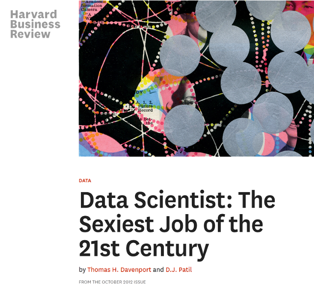
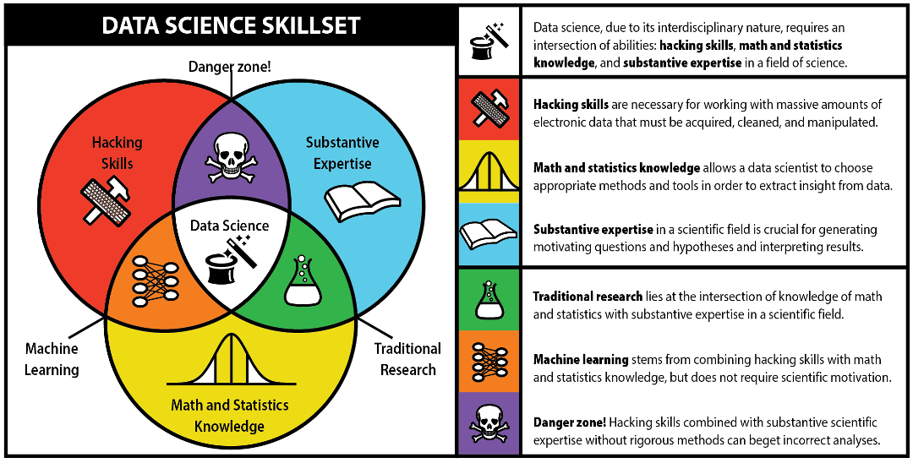
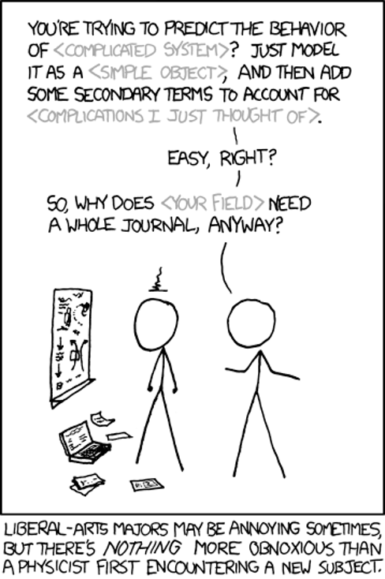

Title: Computers in Urban Studies
Author: Jon Reades
Theme: casa notes
Palette: Purple
---
Layout: SectionTitle
## Managing Your *Own* Environment

^ In principle, we fully support students who want to do things their own way: running their own Python installation, using Docker, tweaking the Vagrant configurations... However, one thing to keep in mind is that there are more than 100 students taking this class, so we are *also* not able to sit down with each person and develop a custom learning environment to suit them as individuals.
^ The approach that we've developed is intended to hide some of the complexity of getting started with managing your own programming environment: we give you full access to the cutting-edge Python libraries and other tools needed to 'do' spatial data science, but with Vagrant and VirtualBox you only need to install 2 applications, download 1 file, and run 1 command. When it works... 
^ There *are* alternatives, such as running Docker directly, or installing everything using Anaconda Python's `conda` tool. But in both these cases there are *more* things that can go wrong and they can go wrong in more complex ways. The command to run Docker containers makes what we do in the Command Line class look straightforward and basic. Solving the Anaconda environment can take over an hour _before_ it even starts installing. I've had it fail on me after solving all night!
^ Similarly, we suggested a way to manage your files so that we had a starting point for trying to help you resolve challenges that you might be having with reading/writing files or pushing/pulling files to Git. Imagine what happens if each and every person puts their files in their _own_ place and then every one of the 100 students asks for help with _their_ setup. It will confuse everyone else (especially the people who are _already_ confused) and take up whole practicals!
^ So here's what we ask: if you know enough to know what to do with an Anaconda YAML file, or can work out how to edit the Vagrantfile yourself, or install Docker and pull an image, then by all means knock yourself out! We are _not_ going to tell you that cannot do something, and eventually you _will_ need to learn to stand on your own two feet. But please do not expect us to support you individually if you've gone off and done your own thing and now 'it doesn't work'. OK? We'll offer advice (if we can) but only during Office Hours and only if no one else is waiting for help.
^ We hope that sounds fair.

---

Layout: Title
# Computers in Urban Studies

---
>  All of this may seem very new and very scary if you have a 'traditional' background in Planning, Geography, or Urban Studies in general. But... 

---

### Wave 1

“A computer in every institution”:
- Roughly the 1950s–70s
- Computers as **‘super-human’ calculators** for data
- Data + models as theory-testing tool

Retrospectively: the ‘first quantitative revolution’.

^ Many see this as incorrect and focus on the theoretical aspect.

---

### Wave 2

“A computer in every office”:
- Roughly the 1980s–2000s
- Computers as tools for **thinking about spatial relationships**
- Explicit modelling of local spatial effects

Retrospectively: the ‘GIS revolution’.

^ I also see this as incorrect because GIS is Wave 1.

---

### Wave 3

“A computer in every thing”:
- Roughly the mid-2000s–?
- Computers as tools for **generating data** (*pace* ABM researchers)
- Geodata being continuously produced as byproduct of other activities
- Shift from researching attributes to behaviours (*pace* Hägerstrand)

Retrospectively: the ‘big data revolution’ or ‘2nd quantitative revolution’.

^ Shift from computers as processors of data **to integrated, pervasive systems** that spew out data on *everything*.

---

### All Waves Still Going!

**Wave 1: Computers help me do it** **faster**

- GIS is ‘just’ the industrial revolution impacting cartography.

**Wave 2: Computers help me to** **think**

- Geocomputation & local stats are qualitatively & meaningfully different.

**Wave 3: Computers help me to learn**

- Not ‘just’ about the ‘bigness’ of data, though that is important.

^ Wave 2 is about implementing ideas such as recursion and iteration – these could, in theory, have been tackled in Wave 1, but in practice that’s not what people were doing.

^ Wave 3 is about more explicitly allowing computers to learn about data so that we can extract insight from these models – these could also, in theory, have been tackled in Wave 2 but in practice that’s not what people were doing.

^ I’m not totally happy about my description of Wave 3 and will try to dig into this in a little more detail but suggests welcome!

---

### Anticipated by Hägerstrand (1967)

> I think that the computer can do three different and useful things for us. The first and simplest operation is... **descriptive mapping** the second... is the **analytical one** The third kind of service is... to run **process models** by which we might try to reproduce observed or create hypothetical chains of events of a geographical nature. <cite>T. Hägerstrand (1967), *‘The Computer and the Geographer’*, *TiBG*</cite>

---

### But Persistent Critiques

>  There is a clear disparity between the sophisticated theoretical and methodological framework which we are using and our ability to say anything really meaningful about events as they unfold around us. There are too many anomalies... There is an ecological problem, an urban problem... and yet we seem incapable of saying anything of any depth or profundity about any of them. When we do say something it appears trite and rather ludicrous. <cite>Harvey (1972, p.6)</cite>

---
Layout: Split

+++
### Data *science*?
- Industry-led
- Spatially ignorant (often)
- Disciplinarily greedy (often)

---

[Source](http://berkeleysciencereview.com/how-to-become-a-data-scientist-before-you-graduate/)

^ Personally, I think that you get to danger zones everywhere here, not just at the intersection between hacking and substantive expertise. 

---

### What *is* Different?

According to Donoho (2017) DS differs from plain old ‘statistics’ through an emphasis on, and interest in:

1. Data gathering, preparation, and exploration; 
2. Data representation and transformation; 
3. Computing with data; 
4. Data visualisation and presentation; 
5. Data modelling; and
6. A reflexive ‘science of data science’.

---

### In Practice...

I think there are several distinguishing features that I encounter in day-to-day (geography) work:
- Data-driven methods development & deployment
- Explicit tuning/meta-parameterisation
- Explicit feature optimisation/engineering
- Explicit training/testing from ‘one shot’ data
- ‘Black boxes’ feature prominently & ‘online learning’ emerging quickly

Data science as **process** and **pipeline**, not just **input** to research.

---
Layout: Split
### Do We Need It?

+++
### More readings... 

- O'Sullivan, D. and Manson, S.M. (2015) 'Do physicists have geography envy? And what can geographers learn from it?' *Annals of the Association of American Geographers* 105(4), [DOI](https://doi.org/10.1080/00045608.2015.1039105).
- Scheider, S. and Nyamsuren, E. and Kruiger, H. and Xu, H. (2020) 'Why georgaphic data science is not a science', *Geography Compass*, [DOI](https://doi.org/10.1111/gec3.12537).

[Image Source](https://xkcd.com/793/)
