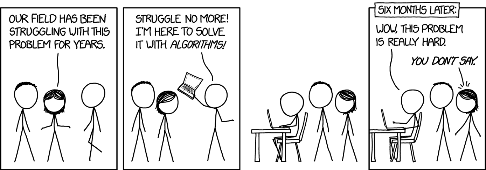
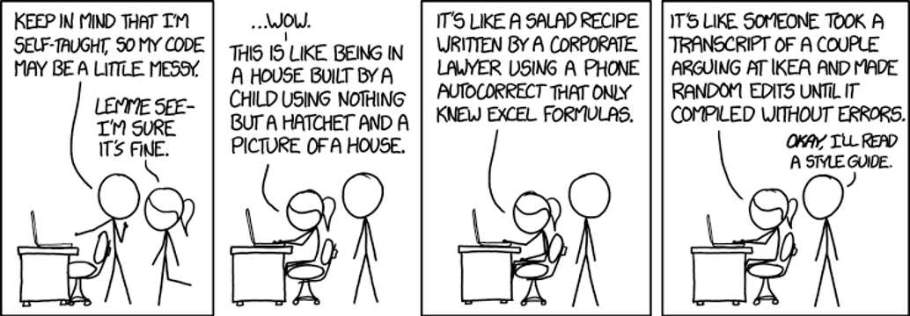

Title: Principles of Programming
Author: Jon Reades
Theme: notes
Palette: Violet
Size: Wide
---
Layout: Title
# Principles of Programming

---

## What is Programming *About*?

According to the [BBC](https://www.bbc.co.uk/bitesize/guides/zp92mp3/revision/1) & [Google](https://edu.google.com/resources/programs/exploring-computational-thinking/index.html#!ct-overview), programming is about:

- **Decomposition**: breaking down a complex problem or system into smaller, more manageable parts.
- **Pattern recognition**: looking for similarities among and within problems.
- **Abstraction**: focusing on the important information only, ignoring irrelevant detail.
- **Algorithms**: developing a step-by-step solution to the problem, or the rules to follow to solve the problem.

---

### What About Computational *Thinking*?

Computational thinking is *not* thinking like a Computer Scientist. It *is* about recognising how to code can help us to understand, and manipulate, the world.

---

### Key Features

Aspects of computational thinking include:

- Recognising how one problem **connects** to other problems.
- Recognising when and how to make things **simpler** and **faster**
- Recognising how **different** ways of tackling a problem gives you **power** to tackle new problems.

See [this keynote](https://youtu.be/TWxwKDT88GU?t=3120) by Lorena Barba (2014); esp. from 52:00 onwards.

^ You already do a lot of this when you *generalise* from your readings to your ideas/understanding!

---

### Why Are These Virtues?

According to Larry Wall the [three virtues of the programmer](http://threevirtues.com/) are:

1. Laziness
2. Impatience
3. Hubris

These are *not* to be taken literally (see [Larry Wall's "Three Virtues of a Programmer" are Utter Bull💩](https://hackernoon.com/larry-walls-three-virtues-of-a-programmer-are-utter-bullshit-fykp32ck)).

^ Automate the boring stuff, focus on the interesting bits! And it's not about *quantity* of code, it's about *quality*.

^ Use code to save time, but don't just jump head-first into problems.

^ When something isn't working well you *want* to make it work better/faster/more efficiently...

---

### Four Quotes to Remember

1. *Computers make very fast, very accurate mistakes.*
2. *A computer program does what you tell it to do, 
    not what you want it to do.*
3. *Only half of programming is coding. 
    The other 90% is debugging.*
4. *Weeks of coding can save you hours of planning.*

---

### And One More...

> Experience is the name everyone gives to their mistakes.
>
> -- Oscar Wilde

---

## Algorithms

---

### Algorithm as Recipe... 

---

### Following a Recipe is Easy, Right?


[Source](https://xkcd.com/1743/)

---

### Calculating the Mean

Given these numbers, what's the average?
```
1, 4, 7, 6, 4, 2
```

---

### As a Recipe

1. Take a list of numbers
2. Start a *count* of numbers in the list at 0
3. Start a *sum* of numbers in the list at 0
4. Take a number from the list:
   - Add 1 to the *count*
   - Add the value of the number to the *sum*
5. Repeat step #4 until no numbers are left in the list.
6. Divide the *sum* by the *count*
7. Report this number back to the user

---

### As Python

```python
numbers = [1, 4, 7, 6, 4, 2]
total   = 0
count   = 0
for num in numbers:
  total = total + num 
  count = count = 1
mean = total / count
print(mean)
```

---

### Why We Still Haven't 'Solved It'



[Source](https://xkcd.com/1831/)

---

Computers are *good* at:

- Doing *exactly* what they are told.
- Doing it *over and over* indefinitely.

Computers are *not good* at:

- Solving problems that you can't define.
- Creating new knowledge.

---

## Languages

Computer languages come with all of the ‘baggage’ of human languages; they have:

- A vocabulary (reserved words)
- A grammar (syntax)
- Rules about the kinds of things you can say (grammar)
- Styles and idiosyncrasies all their own (history)

In this module we will use the Python programming language. We could *also* teach this same content in R.

---

### Python

```python
numbers = [1, 4, 7, 6, 4, 2]
total   = 0
count   = 0
for num in numbers:
  total = total + num 
  count = count = 1
mean = total / count
print(mean)
```

---

### R

```R
numbers = c(1, 4, 7, 6, 4, 2)
total   = 0
count   = 0
for (num in numbers) {
  total = total + num
  count = count + 1
}
mean = total / count
print(mean)
```

---

### Finally: Style

Although all programmers develop their own *style* (see: writing in *any* language), Python encourages coders to use a *consistent* style so that others can pick up your code and make sense of what’s going on (see: comments!).

Two useful resources:

- [*The Hitchhiker's Guide to Python*](http://docs.python-guide.org/en/latest/writing/style/)
- [*A summary of Python code style conventions*](https://robinwinslow.uk/2014/01/05/summary-of-python-code-style-conventions/)

---

Good code is consistent in being **readable**.

>  It’s okay to figure out murder mysteries, but you shouldn’t need to figure out code. You should be able to read it. 
>
> -- Steve McConnell

---



[Source](https://xkcd.com/1513/)

---

> Science is what we understand well enough to explain to a computer. Art is everything else we do. 
>
> -- Donald Knuth, [*Things a Computer Scientist Rarely Talks About*](https://www.goodreads.com/book/show/484459.Things_a_Computer_Scientist_Rarely_Talks_About)
