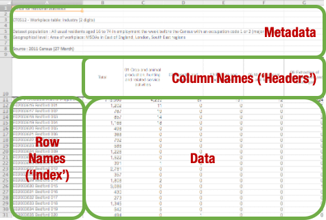

Theme: casa notes
Palette: Purple
Size: Wide
Title: Logic
Author: Jon Reades

---

Layout: Title

# Let's Talk Data

---

## File Formats

In order to read a file we need to know:

- What distinguishes one *record* from another?
- What distinguishes one *field* from another?
- What ensures that a field or record is *valid*?
- Does the data have row or column names?
- Does the data have any metadata included?

---


^ Here's *raw* Excel data. 

^ What would we say the row and column names *currently* are?

---



^ Metadata is relevant to our understanding *of* the data and so is important, but it's not relevant to treating the data *as* data so we need to be able to skip it.

^ Column names are going to be how we access a given attribute for each observation.

^ Row names are not normally data themselves, but are basically labels or identifiers for observations. Another term for this would be the data index.

^ If we store row and column names/indices separately from the data then we don't have to treat them as 'special' or factor them into, for example, the calculation of summary stats.

---

### Most Common Formats

| Extension         | Field Separator                                      | Record Separator                    |
| ----------------- | ---------------------------------------------------- | ----------------------------------- |
| `.csv`            | `,` but commas can appear in fields enclosed by `"`. | `\n` but could be `\r` or `\r\n`.   |
| `.tsv` or `.tab`  | `\t` and unlikely to appear in fields.               | `\n` but could be `\r` or `\r\n`.   |
| `.xls` or `.xlsx` | Binary, you need a library to read.                  | Binary, you need a library to read. |
| `.spss` or `.sas` | Binary, you need a library to read.                  | Binary, you need a library to read. |

^ One of the reasons we like CSV and TSV files is that they can be opened and interacted with using the Command Line directly. As soon as you get into binary file formats you either need the original tool (and then export) or you need a tool that can *read* those formats. So the complexity level rises very quickly. 

^ Of course, sometimes you can gain (e.g. SPSS or SAS) in terms of obtaining information about variable types, levels, etc. but usually you use these when that's all that's available *or* when you want to **write** a file for others to use.

## Introducing Pandas


^ Pandas is an open source, library providing high-performance, easy-to-use data structures and data analysis tools for the Python programming language.

^ We will now start to use the Pandas package, which allows us to create ‘data frame’ objects which supports a range of **very** useful data analysis methods.

---

### Using Pandas

So here’s some code to read a CSV file:

```python
import pandas as pd          # import class
csv_df = pd.read_csv(file)   # load a CSV
type(csv_df)                 # not simple data
csv_dv.head()                # first few rows
csv_df[’SomeColName’].mean() # summarise
```

---

### Using Pandas (cont'd)

Pandas is probably (together with scipy and numpy) the *main* reason that Python has become popular for data science. According to ‘Learn Data Sci’ (below) it accounts for 1% of *all* Stack Overflow question views!

You will want to bookmark these:

- [pandas.pydata.org](https://pandas.pydata.org/)
- [pandas tutorial for beginners](https://www.learndatasci.com/tutorials/python-pandas-tutorial-complete-introduction-for-beginners/)
- 