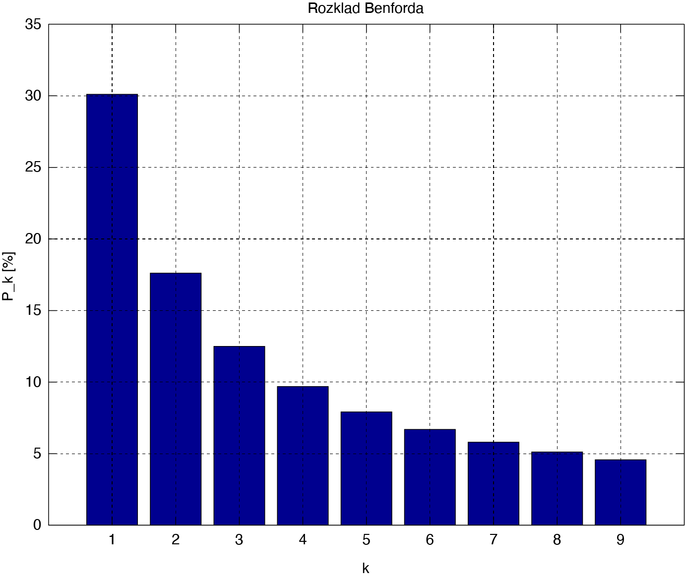
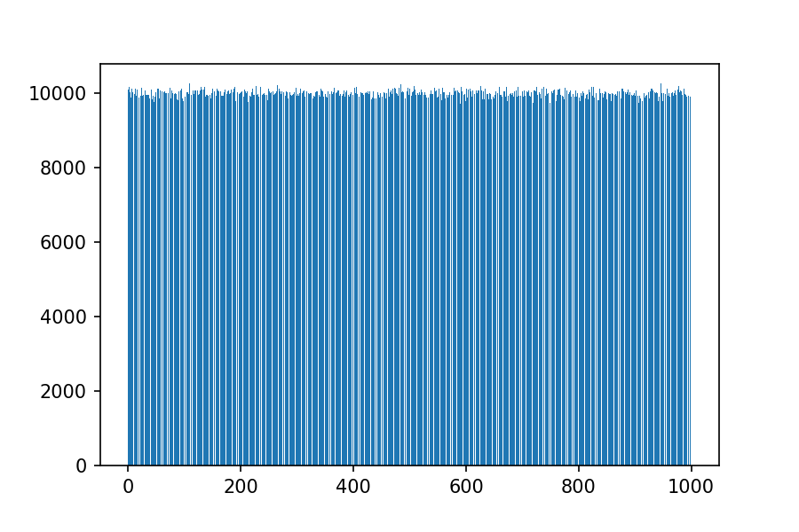

Theme: casa notes
Palette: Purple
Size: Wide
Title: Logic
Author: Jon Reades

---
Layout: Title
# Fooled by Randomness

---
## Not Really Random



[Benford's Law](https://en.wikipedia.org/wiki/Benford%27s_law#:~:text=Benford's%20law%2C%20also%20called%20the,life%20sets%20of%20numerical%20data.&text=If%20the%20digits%20were%20distributed,about%2011.1%25%20of%20the%20time), which has [applications in data science](https://towardsdatascience.com/what-is-benfords-law-and-why-is-it-important-for-data-science-312cb8b61048) and [fraud detection](https://www.journalofaccountancy.com/issues/2017/apr/excel-and-benfords-law-to-detect-fraud.html).

^ Genuine randomness is *hard*. Most of us, both humans and computers, tend to use shortcuts when generating random numbers.

^ People are *really* bad at generating random numbers. Bendford's law is used by auditors to look for abnormalities in financial returns.

^ Computers are better, but they are also lazy.

---
## Reproducibility: Good or Bad?

Depends on the problem:

- Banking and Encryption: bad
- Sampling and testing: could go either way
- Reproducing research/documentation: good

^ OK, technically, even encryption needs to be reproducible to allow for *de*cryption, but you sure don't want it to be *easy*.

---
### Not Very Good Encryption

| Cyphertext | Output |
| :-------------- | :----- |
| ROT0 | To be or not to be, That is the question | 
| ROT1 | Up cf ps opu up cf, Uibu jt uif rvftujpo | 
| ROT2 | Vq dg qt pqv vq dg, Vjcv ku vjg swguvkqp |
| ... | ... |
| ROT9 | Cx kn xa wxc cx kn, Cqjc rb cqn zdnbcrxw |

Known as the Caesar Cypher, but since the transformation is simple (`A..Z+=x`) decryption is easy. How can we make this harder?

---
### Python is Random

```python
import random
random.randint(0,10)
> 8
random.randint(0,10)
> 4
random.randint(0,10)
> 0
random.randint(0,10)
> 8
```

See also: `random.randrange`, `random.choice`, `random.sample`, `random.random`, `random.gauss`, etc.

---
### And Repeat...

```python
import random
size = 10
data = [0] * size

tests = 100000
while tests > 0:
    data[random.randint(0,len(data)-1)] += 1
    tests -= 1

print(data)
```

^ What will this return? 

^ Will it hold for more than 10 numbers?

---
### Aaaaaaaaaaand Repeat

```python
import random 
from matplotlib import pyplot as plt
import numpy as np

size = 1000
data = [0] * size

tests = 10000000
while tests > 0:
    data[random.randint(0,len(data)-1)] += 1
    tests -= 1

fig = plt.figure()
plt.bar(np.arange(0,len(data)), data)
fig.savefig('Random.png', dpi=150, transparent=True)
```

---
### Aaaaaaaaaaand Repeat



---
## Seeding Keys

Technically, computers use *pseudo*-random number generators. These are initialised with a **seed** to generate **sequences**.

The *same* seed will yield the *same* sequence.

^ You might look at that uniform distribution and think 'not bad', but that's not good enough for encryption and it's also not good for reproducibility.

---
### Setting a Seed

Two main libraries where seeds are set:
```python
import random
random.seed(42)

import numpy as np
np.random.seed(42)
```

^ Why do you often see 42 used as a seed?

---
### Seeds and State

```python
import random
random.seed(42)
st = random.getstate()
for r in range(0,3):
    random.setstate(st)
    print(f"Repetition {r}:")
    ints = []
    for i in range(0,10):
        ints.append(random.randint(0,10))
    print(f"\t{ints}")
```

---
### Question!

> Where would you use a mix of randomness and reproducbility as part of a **data** analysis process?

^ Hint: With a large data set it will often be useful to be able draw a random... what? But for reproducible analysis we will that random... what?... to be the same each time!

---
Layout: SectionTitle
## Other Applications

---
## Hashing

Checking for changes (usally in a security context).
```python
import hashlib

r1 = hashlib.md5('CASA Intro to Programming'.encode())
print("The hex equivalent of r1 is: ", end="")
print(r1.hexdigest())

r2 = hashlib.md5('CASA Intro to Programming '.encode())
print("The hex equivalent of r2 is: ", end="")
print(r2.hexdigest())
```

Outputs:
```bash
"The hex equivalent of r1 is: acd601db5552408851070043947683ef"
"The hex equivalent of r2 is: 4458e89e9eb806f1ac60acfdf45d85b6"
```

---
## And Note...
```python
import requests
night = requests.get("http://www.gutenberg.org/ebooks/1514.txt.utf-8")
print(night.text[30:70])
print(len(night.text))
r3 = hashlib.md5(night.text.encode())
print("The hex equivalent of r3 is: ", end="") 
print(result.hexdigest())
```

Outputs:
```bash
112127
"A Midsummer Night's Dream by Shakespeare"
"The hex equivalent of r3 is: acd601db5552408851070043947683ef"
```
  
^ Can be applied to *anything*: even one byte's difference (e.g. in a application) can lead to a different hash output.

^ But notice too that hashes are always the same length. 
  
---
## JupyterLab Password

You may have noticed this in Vagrantfile/Docker:
```bash
'sha1:5b1c205a53e14e:0ce169b9834984347d62b20b9a82f6513355f72d'
```

How this was generated:
```python
import uuid, hashlib
salt = uuid.uuid4().hex[:16] # Truncate salt
password = 'casa2021'
hashed_password = hashlib.sha1(password.encode() + 
                  salt.encode()).hexdigest()
print(':'.join(['sha1',salt,hashed_password]))
```

Replace the `JUPYTER_PWD` parameter in the start-up string for Docker or Vagrant.

Don't set your passwords [this way](https://edition.cnn.com/2019/04/22/uk/most-common-passwords-scli-gbr-intl/index.html).

---
## Encryption & Security

Simple hashing algorithms are not normally secure enough for full encryption. Genuine security training takes a whole degree + years of experience.

Areas to look at if you get involved in applications:

- Public and Private Key Encryption (esp. OpenSSL)
- Privileges used by Applications (esp. Docker)
- Revocable Tokens (e.g. for APIs)
- Injection Attacks (esp. for SQL)