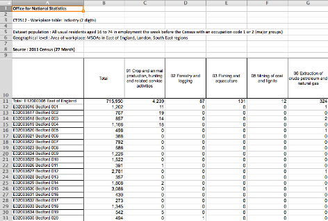

Theme: casa notes
Palette: Purple
Size: Wide
Title: File Formats
Author: Jon Reades

---
Layout: Title
# Files to Data

---
## Getting Started

In order to read a file you need to know a few things:

- What distinguishes **one record** from another?
- What distinguishes **one field** from another?
- What ensures that a field or record **is valid**?
- Does the data set have **row or column names**? (a.k.a. headers & metadata)
- Is the metadata in a separate file or embedded in the file?

---
### Structure of a Tabular Data File

Row and column names make it a lot easier to find and refer to data (_e.g._ the 'East of England row' or the 'Total column') but they are **not data** and don't belong in the data set itself.

^ *Pro tip*: if we store column and row names separately from the data then we can access everything easily without having to factor in any ‘special’ values!

Usually, one record (a.k.a. observation) finishes and the next one starts with a 'newline' (`\n`) or 'carriage return (`\r`) or both (`\r\n`) but it *could* be anything (e.g. `EOR`).

^ Noice also the \r and \n here. This is the escape sequence again that you also encountered when dealing with the Shell as well. Remember that `\ ` is necessary if you have a space in your file name or path.

Usually, one field (a.k.a. attribute or value) finishes and the next one starts with a comma (`,`) which gives rise to CSV (Comma-Separate Values), but it could be tabs (`\t`) or anything else too (`;` or `|` or `EOF`).

  How would we **choose** a good field separator?

---

> Reading data is a **very** common challenge so... chances are that there is a package or class that can help us to do this! You **don't** need to tell Python how to read Excel files, SQL files, web pages... find a package that does it for you!

^ What you *do* want, if possible, is a tool that makes it easy to take the 'native' data types of another format and sensibly convert those to the closest equivalent in Python with minimal effort.

---

### Most Common Formats

| Extension         | Field Separator                               | Record Separator                    | Python Package      |
| ----------------- | --------------------------------------------- | ----------------------------------- | ------------------- |
| `.csv`            | `,` but can appear in fields enclosed by `"`. | `\n` but could be `\r` or `\r\n`.   | `csv`               |
| `.tsv` or `.tab`  | `\t` and unlikely to appear in fields.        | `\n` but could be `\r` or `\r\n`.   | `csv` (!)           |
| `.xls` or `.xlsx` | Binary, you need a library to read.           | Binary, you need a library to read. | `xlrd`/`xlsxwriter` |
| `.sav` or `.sas` | Binary, you need a library to read.           | Binary, you need a library to read. | `pyreadstat`        |

^ One of the reasons we like CSV and TSV files is that they can be opened and interacted with using the Command Line directly. As soon as you get into binary file formats you either need the original tool (and then export) or you need a tool that can *read* those formats. So the complexity level rises very quickly. 

^ Of course, sometimes you can gain (e.g. SPSS or SAS) in terms of obtaining information about variable types, levels, etc. but usually you use these when that's all that's available *or* when you want to **write** a file for others to use.

---

## 'Mapping' Data Types

You will often see the term 'mapping' used in connection to data that is *not* spatial, what do they mean? A `map` is the term used in *some* programming languages for a `dict`! So it's about `key : value` pairs again.

Here's a mapping

| Input (e.g. Excel)                | Output (e.g. Python)                                         |
| --------------------------------- | ------------------------------------------------------------ |
| NULL, N/A, ""                     | `None` or `np.nan`                                           |
| 0..*n*                            | `int`                                                        |
| 0.00...*n*                        | `float`                                                      |
| True/False, Y/N, 1/0              | `bool`                                                       |
| R, G, B (etc.)                    | `int` or `str` (technically a `set`, but hard to use with data sets) |
| 'Jon Reades', 'Huanfa Chen', etc. | `str`                                                        |
| '3-FEB-2020', '10/25/20', etc.    | `datetime` module (`date`, `datetime` or `time`)             |

^ These would be a mapping of variables between two formats. We talk of mapping any time we are taking inputs from one data set/format/data structure as a lookup for use with *another* data set/format/data structure.

^ Have a think about how you can use an `int` to represent **nominal data**. There are two ways: one of which will be familiar to students who have taken a stats class (with regression) and one of which is more intuitive to 'normal' users... 

---

### Testing a Mapping

As we'll see over the remainder of the term, working out an *appropriate* mapping (representation of the data) can take up *enormous* amounts of time. **You should never assume that the data matches the spec.**

> It's commonly held that 80% of data science is *data cleaning*.

The Unix utilities (`grep`, `awk`, `tail`, `head`) can be very useful for quickly exploring the data in order to develop a *basic* understanding of the data and to catch *obvious* errors.

---
Layout: SectionTitle
## Why This Isn't Easy

---

^ Here's *raw* Excel data. 

^ What would we say the row and column names *currently* are?

---

^ Metadata is relevant to our understanding *of* the data and so is important, but it's not relevant to treating the data *as* data so we need to be able to skip it.

^ Column names are going to be how we access a given attribute for each observation.

^ Row names are not normally data themselves, but are basically labels or identifiers for observations. Another term for this would be the data index.

^ If we store row and column names/indices separately from the data then we don't have to treat them as 'special' or factor them into, for example, the calculation of summary stats.

^ Also have to consider trade-offs around mapping the full column names on to something a little faster and easier to type!

<!--

### Label These

How would you divide this up into: Metadata; Column Names; Row Names; and Data?

<table>
  <tr>
    <td>0</td>
    <td colspan="5">Office for National Statistics</td>
  </tr><tr>
    <td>1</td>
    <td colspan="5">CT0512 - Workplace table: Industry (2 digits)</td>
  </tr><tr>
    <td>2</td>
    <td>&nbsp;</td>
    <td>Total</td>
    <td>01 Crops...</td>
    <td>02 Forestry...</td>
    <td>03 Fishing...</td>
  </tr><tr>
    <td>3</td>
    <td>East of England</td>
    <td>715,950</td>
    <td>4,239</td>
    <td>87</td>
    <td>131</td>
  </tr><tr>
    <td>4</td>
    <td>E02003616</td>
    <td>1,202</td>
    <td>11</td>
    <td>0</td>
    <td>0</td>
  </tr><tr>
    <td>5</td>
    <td>E02003617</td>
    <td>767</td>
    <td>19</td>
    <td>0</td>
    <td>0</td>
  </tr><tr>
    <td>6</td>
    <td>E02003618</td>
    <td>857</td>
    <td>14</td>
    <td>0</td>
    <td>0</td>
  </tr><tr>
    <td>7</td>
    <td>E02003619</td>
    <td>1,166</td>
    <td>18</td>
    <td>0</td>
    <td>0</td>
  </tr>
</table>
-->
---

## Why This Isn't Easy (Part 2)

### Things That Can Go Wrong...

A selection of *real* issues I've seen in my life:

1. Truncation: server ran out of diskspace or memory, or a file transfer was interrupted.
2. Translation: headers don't line up with data.
3. Swapping: column order differs from spec.
4. Incompleteness: range of real values differs from spec.
5. Corruption: field delimitters included in field values.
6. Errors: data entry errors resulted in incorrect values or the spec is downright *wrong*.
7. Irrelevance: fields that simply aren't relevant to your analysis.

These will generally require you to engage with columns and rows (via sampling) on an *individual* level.

---

## Resources

- [Reading and writing files](https://www.linkedin.com/learning/learning-python-2/reading-and-writing-files)
- [Working with OS path utilities](https://www.linkedin.com/learning/learning-python-2/working-with-os-path-utilities)
- [Files and file writing](https://www.linkedin.com/learning/learning-the-python-3-standard-library/files-and-file-writing)
- [Using file system shell methods](https://www.linkedin.com/learning/learning-python-2/using-file-system-shell-methods)
- [Opening files](https://www.linkedin.com/learning/python-essential-training-2/opening-files)
- [Text vs. binary mode](https://www.linkedin.com/learning/python-essential-training-2/text-vs-binary-mode)
- [Text files](https://www.linkedin.com/learning/python-essential-training-2/text-files)
- [petl](https://petl.readthedocs.io/en/stable/)
