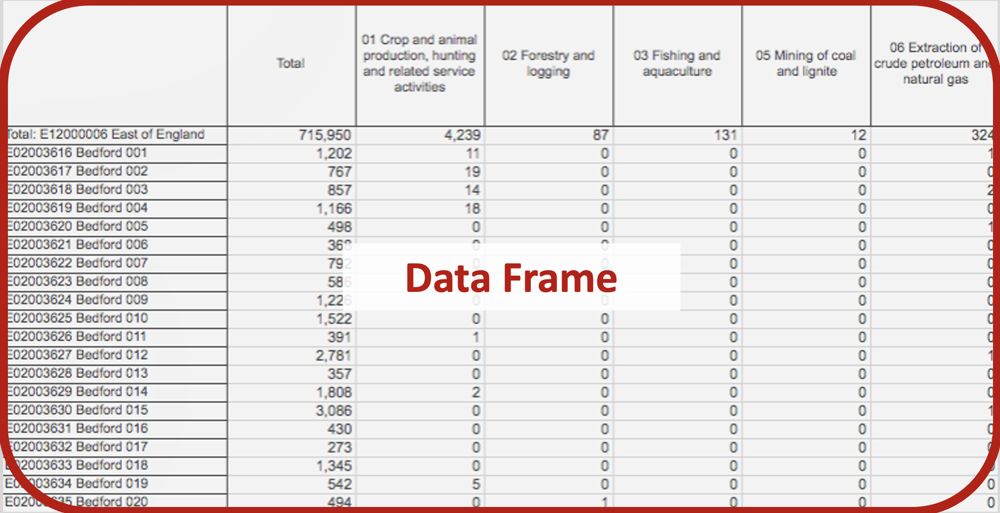
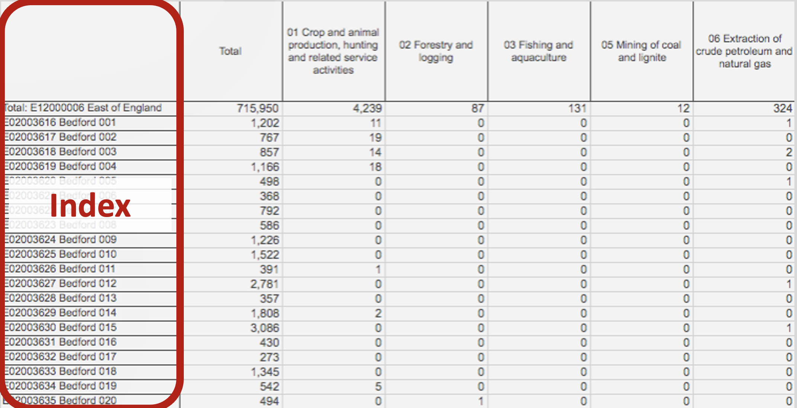
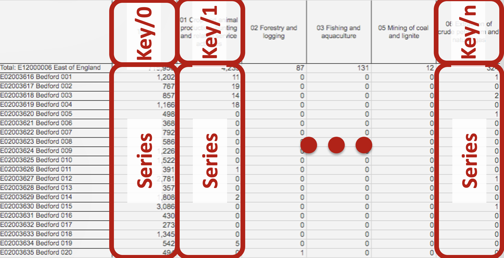
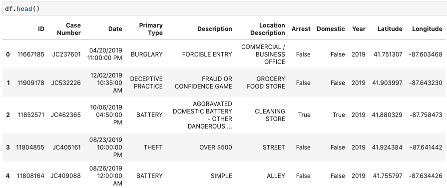

Theme: casa notes
Palette: Purple
Size: Wide
Title: Logic
Author: Jon Reades

---
Layout: Title
# Introducing Pandas

^ Feel like I've been signposting this for a _really_ long time, so I hope you feel like it's worth it.

---


^ Pandas is derived from 'panel data' as used in econometrics, but also a play on 'Python data analysis' (according to Wikipedia at least).

^ Pandas is an open source, library providing high-performance, easy-to-use data structures and data analysis tools for the Python programming language. It supports both numerical and time series data.

^ We will now start to use the Pandas package, which allows us to create ‘data frame’ objects which supports a range of **very** useful data analysis methods.

---
### Why Pandas?

Pandas is probably (together with scipy and numpy) the *main* reason that Python has become popular for data science. According to ‘Learn Data Sci’ it accounts for 1% of *all* Stack Overflow question views!

You will want to bookmark these:

- [pandas.pydata.org](https://pandas.pydata.org/)
- [Pandas Docs](https://pandas.pydata.org/pandas-docs/stable/index.html)
- [pandas tutorial for beginners](https://www.learndatasci.com/tutorials/python-pandas-tutorial-complete-introduction-for-beginners/)

---

### Pandas Terminology (Data Frame)



---

### Pandas Terminology (Index)



---

### Pandas Terminology (Series)



---

### Pandas Terminology (Slice)


---

## Using Pandas

So here’s some code to read a CSV file:

```python
import pandas as pd      # import package
# Bitly link for: https://github.com/jreades/i2p/raw/master/data/src/2019-sample-Crime.csv
url='https://bit.ly/31NP4fx'
df = pd.read_csv(url)    # load a (remote) CSV
type(df)                 # not simple data type
print(df.columns.values) # column names
```

Output:

```python
<class 'pandas.core.frame.DataFrame'>
['ID' 'Case Number' 'Date' 'Primary Type' 'Description'
 'Location Description' 'Arrest' 'Domestic' 'Year' 'Latitude' 'Longitude']
```

---

### Summarise a Data Frame

```python
df.describe() # Information about each Series
df.info()     # Information about each Series and the df
```

`df.info` is more about data types and memory usage. `df.describe` is for summarising information about the distribution of values in every series.

---

### Familiar?

This should be looking *eerily* familiar:

```python
print(type(df['Latitude']))          # type for column
print(type(df['Latitude'].values))   # type for values
print(df['Latitude'].values[:5])     # first five values
print(f"1: {df['Latitude'].mean()}") # summarise a series/column
print(f"2: {df.Latitude.mean()}")    # if no spaces in name
```

Produces: 

```python
<class 'pandas.core.series.Series'>
<class 'numpy.ndarray'>
[41.75130706 41.90399688 41.88032861 41.92438396 41.75579713]
1: 41.84550008439
2: 41.84550008439
```

---
### Jupyter Formatting

Pandas is also 'Jupyter-aware', meaning that output can displayed directly in Jupyter in 'fancy' ways:



---
### Familiar?

```python
df.head(3)                   # all columns first 3 rows
df[['ID','Date','Year']].tail(3) # selected columns, last 3 rows
df.sample(frac=0.3)           # a random 30% sample
df.sample(3, random_state=42) # set state of random number generator
df.sample(3, random_state=42) # will yield same sample
```

---
### Data Frames vs Series

Any operation on a data frame *returns* a data frame.

Any operation on a series *returns* a series.

By default, any operation returns a *shallow copy* and the original is unchanged *unless* you specify `inplace=True` (for methods that allow it).

If you need a full copy then use the `copy()` method (e.g. `df.copy()` or `df.Series.copy()`).

---
Layout: SectionTitle
## What Can We Do? 

---
### Chaining

Operations on a Data Frame **return a DataFrame** and operations on a Series **return a Series**, allowing us to 'chain' steps together:

```python
df.sort_values(['Year','ID'], ascending=False).head(20).median()
```

---
### Selection

We can subset the data using selection criteria

```python
# All rows where Primary Type is ASSAULT
df[
  df['Primary Type']=='ASSAULT'
]

# Calculations on a slice (returns mean centroid!)
df[df['Primary Type']=='ASSAULT'][['Longitude','Latitude']].mean()

# Two conditions with a bit-wise AND
df[
  (df['Primary Type']=='ASSAULT') &
  (df['Description']=='AGGRAVATED: HANDGUN')
]

# Two conditions with a bit-wise OR
df[
  (df['Primary Type']=='ASSAULT') |
  (df['Primary Type']=='THEFT')
]
```

---
Layout: SectionTitle
## Now we can automate... data anlysis!

---

### Dealing with Types

A Data Series can *only* be of one type:

| Pandas Dtype    | Python Type      | Usage                       |
| --------------- | ---------------- | --------------------------- |
| `object`        | `str` or mixed   | Text or mixed columns       |
| `int64`         | `int`            | Integer columns             |
| `float64`       | `float`          | Floating point columns      |
| `bool`          | `bool`           | True/False columns          |
| `datetime64`    | N/A (`datetime`) | Date and time columns       |
| `timedelta[ns]` | N/A (`datetime`) | Datetime difference columns |
| `category`      | N/A (`set`)      | Categorical columns         |

---

### Changing the Type

```python
print(df['Primary Type'].unique()) # Find unique values
print(df['Primary Type'].dtype.name)
df['Primary Type'] = df['Primary Type'].astype('category')
print(df['Primary Type'].dtype.name)
print(df['Primary Type'].describe())
```

Outputs:

```python
['BURGLARY' 'DECEPTIVE PRACTICE' 'BATTERY'...]
object   # < before `as type`
category # < after `as type`
count       100
unique       15
top       THEFT
freq         28
Name: Primary Type, dtype: object # category==special type of object
```

---
### Datetime Data

What do we do here?

```python
df.Date.to_list()[:3]
>>> ['04/20/2019 11:00:00 PM', '12/02/2019 10:35:00 AM', '10/06/2019 04:50:00 PM']
```

Pandas handles date and times using a `datetime` type that also works as an index (more on these later):
```python
df['dt'] = pd.to_datetime(df.Date.values, 
              format="%m/%d/%Y %H:%M:%S %p")
```

These follow [the formatting conventions](https://docs.python.org/3/library/datetime.html#strftime-and-strptime-format-codes) of `strftime` (string format time) for conversion.

---
### Datetime Formats 

Examples of `strftime` conventions include: 

| Format | Applies To |
| :----- | :--------- |
| %d | 2-digit day |
| %m | 2-digit month |
| %y | 2-digit year |
| %Y | 4-digit year |
| %p | AM/PM |

---
### Tidying Up

This is one way, there are many subtleties...
```python
# Fix categories
mapping = {}
# df['Primary Type'].unique().to_list() also works
for x in df['Primary Type'].cat.categories.to_list():
    mapping[x]=x.title()
df['Primary Type'] = df['Primary Type'].cat.
                             rename_categories(mapping)
```

There are *many* other things that we can do, many of them accessible via Google! For instance, to deal with pricing information treated as a string:

```python
df2['price'].str.replace('$','').astype(float)
```

---
### Other Types of Tidying Up

The `inplace=True` option means that `df` itself is changed. Otherwise `df` is not touched and a copy is returned:

```python
print(df.columns.values)
df.drop(columns=['Year'], inplace=True)
print(df.columns.values)
```

There is also `df.dropna()` which can apply to rows or columns with NULL values. 

Columns are dropped by `df.drop(index=[...])`; however, I often prefer: `df = df[df.ID>11934410]` (selection!).

 Why might you want the default to *not* be `in_place`?

---
### Accessing Data by Location

|       | 0        | 1               | 2                     | 3                  |
| ----- | -------- | --------------- | --------------------- | ------------------ |
|       | **ID**   | **Case Number** | **Date**              | **Primary Type**   |
| 0     | 11667185 | JC237601        | 04/20/2020 11:00:00PM | BURGLARY           |
| 1     | 11998178 | JC532226        | 12/02/2020 10:35:00AM | DECEPTIVE PRACTICE |
| 2 | 11852571 | JC462365        | 10/06/2020 04:50:00PM | BATTERY            |

We can interact with rows and columns by *position* or *name*:

```python
df.iloc[0:2,0:2] # List selection! (':' means 'all')
df.loc[0:2,['ID','Case Number']] # Dict selection
```
These actually return different results because of the index: `0:2` in `df.loc` returns the rows *labeled* 0, 1, and 2!

---
### Indexes

So by default, pandas *creates* a row index index whose **values** are *0..n* and column index whose **values** are the column names. You will see this if you print out the head:

```python
df.head(3)
```

The left-most column (without) a name is the index.

```python
df.set_index('ID', inplace=True)
df.head(3)
```

---
### Indexes (cont'd)

|      |              | 0               | 1                     | 2                  |
| ---- | ------------ | --------------- | --------------------- | ------------------ |
|      | **ID**       | **Case Number** | **Date**              | **Primary Type**   |
| 0    | **11667185** | JC237601        | 04/20/2020 11:00:00PM | BURGLARY           |
| 1    | **11998178** | JC532226        | 12/02/2020 10:35:00AM | DECEPTIVE PRACTICE |
| 2    | **11852571** | JC462365        | 10/06/2020 04:50:00PM | BATTERY            |

And now:

```python
print(df.loc[11667185,:])
print(df.loc[11667185:11852571,'Case Number':'Date'])
```

*Notice!* We used `iloc` to select rows/cols based on **integer location** and we can use `loc` to select rows/cols based on **name location**.

P.S. You can *reset* the index using `df.reset_index(inplace=True)`.

---
### Saving

Pandas can write to a [wide range of file types](https://pandas.pydata.org/pandas-docs/stable/reference/api/pandas.DataFrame.to_parquet.html), here are some of the more popular ones:

| Command                  | Saved As...                                                  |
| ------------------------ | ------------------------------------------------------------ |
| `df.to_csv(<path>)`      | CSV file. But note [the options](https://pandas.pydata.org/pandas-docs/stable/reference/api/pandas.DataFrame.to_csv.html) to change `sep` (default is `','`) and to suppress index output (`index=False`). |
| `df.to_excel(<path>)`    | XLSX file. But note [the options](https://pandas.pydata.org/pandas-docs/stable/reference/api/pandas.DataFrame.to_excel.html) to specify a `sheet_name`, `na_rep`, and so on, as well as to suppress the index (`index=False`). |
| `df.to_feather(<path>)`  | Feather file also directly usable by R. Requires `pyarrow` to be installed to access [the options](https://pandas.pydata.org/pandas-docs/stable/reference/api/pandas.DataFrame.to_feather.html). |
| `df.to_latex(<path>))`   | Write to LaTeX file to include into main body. [Requires booktabs](https://pandas.pydata.org/pandas-docs/stable/reference/api/pandas.DataFrame.to_latex.html). Could to copy+pasted with `print(df.to_latex())`. |
| `df.to_markdown(<path>)` | Write to Markdown format. [Requires tabulate](https://pandas.pydata.org/pandas-docs/stable/reference/api/pandas.DataFrame.to_markdown.html). Could do copy+paste with `print(df.to_markdown())`. |

In most cases compression is supported automatically (e.g. `df.to_csv('file.csv.gz')`).

---
## Resources

- [Data Cleaning with Numpy and Pandas](https://realpython.com/python-data-cleaning-numpy-pandas/)
- [Pandas dtypes](https://pbpython.com/pandas_dtypes.html)
- [The Index Explained](https://towardsdatascience.com/pandas-index-explained-b131beaf6f7b)
- [Using Pandas iloc](https://www.sharpsightlabs.com/blog/pandas-iloc/)
- [A Clear Explanation of the Pandas Index](https://www.sharpsightlabs.com/blog/pandas-index/)
- [Ufuncs and Apply](https://towardsdatascience.com/pandas-tips-and-tricks-33bcc8a40bb9)
