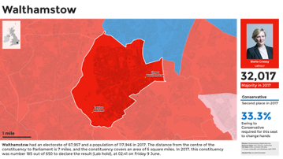
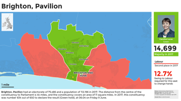
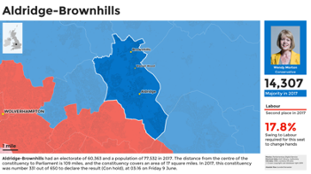
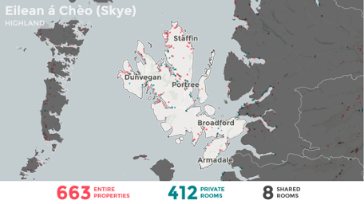
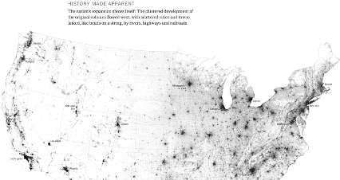
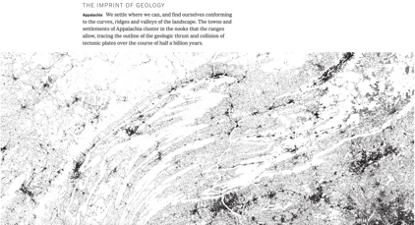
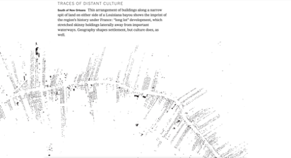
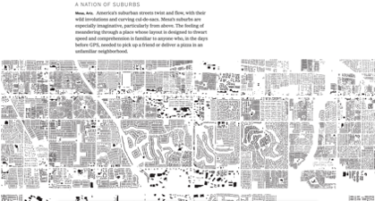

Theme: casa notes
Palet: Purple
Size: Wide

---
Layout: Title
# Computational Mapping

---
Layout: Split
### Purely Computational

*Both* analysis and visualisation are accomplished via code:

- Fully replicable (including random samples).
- Fully documented (to extent commented by dev).
- Fully portable (assuming no platform-specific code).

+++
### Mostly Computational

*Only* the analysis is accomplished via code, visualisation is via a GIS:

- Wider variety of output formats (e.g. Atlases, 3D/web).
- Better support for 'finishing touches' (e.g. scalebars, north arrows, rule-based labels, etc.).
- Better-quality output for less effort (e.g. Model Builder + QGIS styles).

^ Worth reflecting on pros and cons of these: when does one offer benefits over the other?

---
### The Challenge

The hardest part of purely computational approaches is the need to anticipate how maps will look according to variations in:

- The density and type of data
- The context of the data
- The different scales involved
- The number of maps involved
- The need to annotate and label elements

Ultimately, the complexity of the choices here may _require_ the use of a scriptable GIS over `ggplot` or `matplotlib`. 

^ Don't forget that both QGIS and Arc offer a 'Model Builder' that is basically 'visual programming'.

---
### Constituency Cards

Clone and reproduce: [github.com/alasdairrae/wpc](https://github.com/alasdairrae/wpc) and explanation: [cconstituency cards](http://www.statsmapsnpix.com/2019/08/constituency-cards.html).

---
### Short-Term Lets in Scotland

Analysis of Airbnb and other short-term lets in Scotland feeding through into policy-making via [Research into the impact of short-term lets on communities across Scotland](https://www.gov.scot/binaries/content/documents/govscot/publications/research-and-analysis/2019/10/research-impact-short-term-lets-communities-scotland/documents/people-communities-places-research-impact-short-term-lets-communities-scotland/people-communities-places-research-impact-short-term-lets-communities-scotland/govscot:document/people-communities-places-research-impact-short-term-lets-communities-scotland.pdf)

---
### Every Building in America

[Building footprints](https://github.com/Microsoft/USBuildingFootprints/) collected by Microsoft, but presentation by New York Times [highlights society-nature interactions](https://www.nytimes.com/interactive/2018/10/12/us/map-of-every-building-in-the-united-states.html).

---
## Think it Through!

---
Layout: SectionTitle
## Colouring in
---
### A Deceptively Simple Problem

> We want to show data on a map in a way that is **both accurate and informative**.

Why might this *not* be possible?
---
### Classification

Trade-offs:

- The greater the accuracy of a choropleth or other class-based map, the less it’s possible generalise from it.
- There is no 'right' way to group data into an arbitrary number of discrete classes (a.k.a. to generalise).

Humans can only take in so much data at once. Your choice of colour scheme, breaks, and classification can profoundly affect how people see the world.

---
### Six Views of Employment

---
### Six Views of Employment

---
### Six Views of Employment

---
## Consider

We want to:
- Group features with similar values together.
- Show these in a way that doesn't mislead the viewer.

But we have the following problems:
- Too many classes confuse the viewer.
- Too few classes hides structure/pattern.

---
### Choices, Choices

At the *very least* we have the following options:

- Assign classes manually.
- Split range evenly (i.e. equal intervals).
- Split data evenly (i.e. quantiles).
- Split data according to distribution (i.e. SD).
- Split data so that members of each group are more similar to each other than to members of another group (i.e. natural breaks/Jencks).

---
Layout: SectionTitle
## What's Best?
### Look at the Data!

---

> Different colour and break schemes not only give us different **views** of the data, they give us different **understandings** of the data! Each potentially changes how the data looks and, consequently, how we perceive the distribution.

---
### Takeaway: Maps have a 'Rhetoric'

---
## Resources

- [QGIS Styles to Share](https://plugins.qgis.org/styles/)
- [QGIS and 3D Visualisation](https://medium.com/the-pointscene-diaries/3d-map-qgis-guide-4688975b8fb4)
- [Modelling your data processing flow in QGIS](https://geovation.github.io/qgis-processing-modeler)
- [QGIS Documentation](https://docs.qgis.org/3.16/en/docs/)
