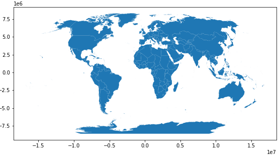
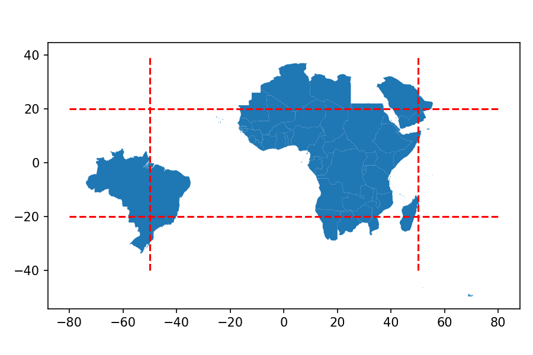
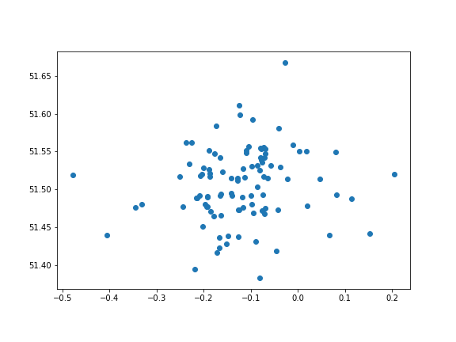
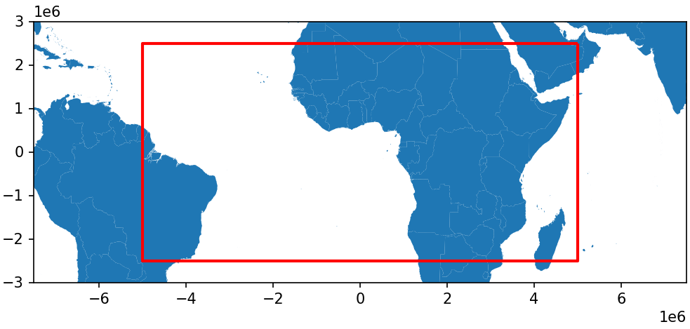

Theme: casa notes
Palette: Purple
Size: Wide
Title: 6.1-Geopandas.md
Author: Jon Reades

---
Layout: Title
# Geopandas
## Pandas Learns about Maps

---
## Two Key Geo-Libraries in Python

### Geopandas
'Geospatial Pandas' provides a set of tools for working with *geo-data* in a pandas-like way. See: [GeoPandas.org](https://geopandas.org/) and [Read the Docs](https://geopandas.readthedocs.io/en/latest/docs.html).

### PySAL
The Python Spatial Analysis Library provides an array of tools for performing spatial *analysis*. Now uses geo-pandas as default data structure. See: [PySAL.org](https://pysal.org/) and [Read the Docs](https://splot.readthedocs.io/en/stable/index.html).

---
Layout: SectionTitle
## Basic Functionality

---
### Reading & Writing

Supported file formats:

| Type | Extension | Notes |
| :--- | :-------- | :---- |
| Shape | `.shp` (etc.) | Maximum compatibility |
| GeoPackage | `.gpkg` | Good default choice |
| GeoJSON | `.geojson` | For web mapping |
| Zip | `.zip` | For use with Shapefiles |
| WKT | `.txt` | Plain-text & SQL |

Additionally, it is possible to read only [subsets of the data](https://geopandas.org/io.html#reading-subsets-of-the-data) using row, column, geometry, and bbox filters.

---
### Reading (Remote Files)

Again, depending on file size you may want to save these locally, but...

```python
import geopandas as gpd
gpkg_src = 'https://bit.ly/2K4JcsB'
world = gpd.read_file(gpkg_src)
world.plot(facecolor='white', edgecolor='darkblue')
```


---
### Writing (Local Files)

Can apparently write any OGR-supported [vector drivers](https://gdal.org/drivers/vector/index.html).

```
world.to_file('world.gpkg', driver='GPKG')
world.to_file('world.shp') # driver='ESRI Shapefile'
world.to_file('world.geojson', driver='GeoJSON')
```

^ If you forget to specify the driver this writes shapefiles to a directory called `world.gpkg`!

---
## Data Structures

GeoPandas does all this by adding two new classes:

- [GeoDataFrame](https://geopandas.org/data_structures.html#geodataframe)
- [GeoSeries](https://geopandas.org/data_structures.html#geoseries)

In principle, a GeoSeries can contain multiple geo-data types, but in practice you'll want to be one of the following `shapely` classes:

1. Points / Multi-Points
2. Lines / Multi-Lines
3. Polygons / Multi-Polygons

---

### Consider

Recall that we can ask if a particular object is an *[instance](https://www.w3schools.com/python/ref_func_isinstance.asp)* of any given class:

```python
print(isinstance(world, str))
print(isinstance(world, gpd.GeoDataFrame))
print(isinstance(world, pd.DataFrame))
```

Prints: `False`, `True`, `True`.

```python
print(isinstance(world.geometry, str))
print(isinstance(world.geometry, pd.Series))
print(isinstance(world.geometry, gpd.GeoSeries))
```

Also prints: `False`, `True`, `True`.

^ So converting from Pandas to GeoPandas works well because GeoPandas knows all about Pandas.

^ You can use a GeoDataFrame anywhere you'd use a DataFrame with no loss of functionality! Same for a GeoSeries, though in this case a GeoSeries cannot perform the same statistical operations.

---
### Projections

Depending on your data source, you may or may not have projection information attached to your GeoDataFrame:

```python
>>> print(world.crs)
epsg:4326
```

But:
```python
>>> world.crs
<Geographic 2D CRS: EPSG:4326>
Name: WGS 84
Axis Info [ellipsoidal]:
- Lat[north]: Geodetic latitude (degree)
- Lon[east]: Geodetic longitude (degree)
Area of Use:
- name: World
- bounds: (-180.0, -90.0, 180.0, 90.0)
Datum: World Geodetic System 1984
- Ellipsoid: WGS 84
- Prime Meridian: Greenwich
```

---
### Finding Projections

You can pretty much find any EPSG you might need at [epsg.io](http://epsg.io/). By far the most commonly-used _here_ are:

- [EPSG\:4326](http://epsg.io/4326) for the World Geodetic System 84 used in GPS.
- [EPSG\:27700](http://epsg.io/27700) for OSGB 1936/British National Grid used in the UK.

_Note_: large territories (such as Canada, China and Russia) may well have _multiple_ projections at the state of provincial level.

---
### Reprojection

For data sets _without_ projection information (i.e. anything loaded from a shapefile) you must `gdf.set_crs(<spec>)`. For all others you should `gdf.to_crs(<spec>)`.

```python
world2 = world.to_crs('ESRI:54030')
world2.plot()
```



^ Different geometry columns can have different projections.

---
### Standards?

> Can you think why the _European Petroleum Standards Group_ is one of the big drivers behind (and users of) high-quality projection data?

^ _Hint_: you _really_ don't want to miss _<what>_?

---
### The Spatial Index

We can use GeoSeries' spatial index directly to perform simple spatial queries:

```python
wslice = world.cx[-50:50, -20:20]
ax = wslice.plot()
```



---
### Attributes

A GeoSeries has attributes like any other Series, but also includes some spatially-specifc ones:

- `area` — if a polygon
- `bounds` — for each feature
- `total_bounds` — for each GeoSeries
- `geom_type` — if you don't already know
- `is_valid` — if you need to test

---
### Methods

Additional GeoSeries methods icnlude:

- `distance()` — returns `Series` measuring distances to some _other_ feature (called as: `<GeoSeries>.distance(<feature>)`)
- `centroid` — returns `GeoSeries` of **strict** centroids (called as: `<GeoSeries>.centroid`)
- `representative_point()` — returns `GeoSeries` of points **within** features
- `to_crs()` and `plot()`, which you've already seen.

^ Note that centroid is _not_ called with parentheses. Technically it's more like an attribute than a method.

---
### Relationship Tests

Simple geographical tests:

- `geom_almost_equals()` — tries to deal with rounding issues when comparing two features.
- `contains()` — is shape contained within some _other_ features.
- `intersects()` — does shape intersect some _other_ features.

---
Layout: SectionTitle
## Point Data
---
### Converting Non-Spatial Data 1

Lat/Long and Northing/Easting benefit from a helper function:

```python
url = 'https://bit.ly/3owocdI'
df  = pd.read_csv(url)

gdf = gpd.GeoDataFrame(df, 
            geometry=gpd.points_from_xy(
                        df['longitude'], 
                        df['latitude'], 
                        crs='epsg:4326'
            )
      )
gdf.plot()
```

^ You can also use list comprehensions (`[x for x in list]`) and `zip` to combine two lists!

---
### CSV to Points in 3 Lines! 



^ Notice that the default plot from a GeoDataFrame is... a map!

---
### Converting Non-Spatial Data 2

Other feature types need to be in some kind of regular format such as [Well-Known Text](https://www.vertica.com/docs/9.2.x/HTML/Content/Authoring/AnalyzingData/Geospatial/Spatial_Definitions/WellknownTextWKT.htm) (WKT), [GeoJSON](https://geojson.org/), or something readable as a Shapely geometry.

```python
bbox = 'POLYGON((5000000.0 2500000.0, 5000000.0 -2500000.0, -5000000.0 -2500000.0, -5000000.0 2500000.0, 5000000.0 2500000.0))'

from shapely import wkt
bgdf = gpd.GeoDataFrame(
                {'id':[0], 'coordinates':bbox})
bgdf['geometry'] = bgdf.coordinates.apply(wkt.loads)
bgdf = bgdf.set_crs('ESRI:54030')
```

^ These are more rarely used for our purposes but knowing that they exist is useful.

---
### From Text to Bounding Box

```python 
scale = int(float('1e7'))
f,ax=plt.subplots(figsize=(8,4))
world2.plot(ax=ax)
bgdf.plot(ax=ax, color='none', edgecolor='r')
ax.set_xlim([-0.75*scale, +0.75*scale])
ax.set_ylim([-3*scale/10, +3*scale/10])
```



---

## Resources

- [GeoPandas on ReadTheDocs](https://geopandas.readthedocs.io/en/latest/docs.html)
- [Dani's GDS Course](https://darribas.org/gds_course/content/home.html)
- [Dani's Web Mapping Course](http://darribas.org/wmn/)
- [Dani's GDS'19 Course](http://darribas.org/gds19/)