Theme: casa notes
Palette: Purple
Size: Wide
Title: File Formats
Author: Jon Reades

---
Layout: Title
# Exploratory Data Analysis
## (With Pandas & GeoPandas)

---
## Epicycles of Analysis

<div align="center">

</div>

---
## Epicyclic Feedback

[Peng and Matsui, *The Art of Data Science*, p.8](http://bedford-computing.co.uk/learning/wp-content/uploads/2016/09/artofdatascience.pdf)

|    | Set Expectations | Collect Information | Revise Expectations |
| :- | :--------------- | :------------------ | :----------- |
| Question | Question is of interest to audience | Literature search/experts | Sharpen question |
| EDA | Data are appropriate for question | Make exploratory plots | Refine question or collect more data | 
| Modelling | Primary model answers question | Fit secondary models / analysis | Revise model to include more predictors | 
| Interpretation | Interpretation provides specific and meaningful answer | Interpret analyses with focus on effect and uncertainty | Revise EDA and/or models to provide more specific answers | 
| Communication | Process & results are complete and meaningful | Seek feedback | Revises anlyses or approach to presentation |

---
### Approaching EDA

There's _no_ hard and fast way of doing EDA, but as a general rule you're looking to:

- Clean
- Canonicalise
- Clean More
- Visualise & Describe
- Review
- Clean Some More
- ... 

^ Cleaning Part 1: testing validity of records (possibly while tracking rejected records for subsequent analysis)

^ Canonicalisation: controling for variation (e.g. typos, capitalisation, formatting, leading/trailing whitespace, different types of NULL values, etc.) and in a spatial context deal with projection and geo-data issues.

^ Cleaning Part 2: further testing of records (e.g. deciding what to do with NaNs, missing values, outside of study area, etc.)

^ Visualise & Describe: covered in QM but we'll take a high-level look at this.

---
### A Related Take

From: [EDA—Don't ask how, ask what](https://medium.com/towards-artificial-intelligence/exploratory-data-analysis-eda-dont-ask-how-ask-what-2e29703fb24a):

- Descriptive Statistics: get a high-level understanding of your dataset
- Missing values: come to terms with how bad your dataset is
- Distributions and Outliers: and why countries that insist on using different units make our jobs so much harder
- Correlations: and why sometimes even the most obvious patterns still require some investigating

---
### _Another_ Take

Here's another view of how to do EDA:

1. Preview data
2. Check total number of entries and column types
3. Check any null values
4. Check duplicate entries
5. Plot distribution of numeric data (univariate and pairwise joint distribution)
6. Plot count distribution of categorical data
7. Analyse time series of numeric data by daily, monthly and yearly frequencies

---
Layout: SectionTitle
## Signal & Noise

---
### What is it?

<div align="center">

</div>

---
### What is it?

<div align="center">

</div>

---
### What is it?

<div align="center">

</div>

---
## Start with a Chart

The problem of relying on statistics alone was amply illustrated by Anscombe’s Quartet (1973)...

- We *are not* very good at looking at spreadsheets. 
- We *are* very good at spotting patterns visually.

Sometimes, we are *too* good; that’s where the stats comes in. Think of it as the ‘tiger in the jungle’ problem..

---
### Anscombe's Quartet

|   X1 |    Y1 |   X2 |   Y2 |   X3 |    Y3 |   X4 |   Y4 |
| ---: | ----: | ---: | ---: | ---: | ----: | ---: | ---: |
| 10.0 |  8.04 | 10.0 | 9.14 | 10.0 |  7.46 | 10.0 | 6.58 |
|  8.0 |  6.95 |  8.0 | 8.14 |  8.0 |  6.77 |  8.0 | 5.76 |
| 13.0 |  7.58 | 13.0 | 8.74 | 13.0 | 12.74 | 13.0 | 7.71 |
|  9.0 |  8.81 |  9.0 | 8.77 |  9.0 |  7.11 |  9.0 | 8.84 |
| 11.0 |  8.33 | 11.0 | 9.26 | 11.0 |  7.81 | 11.0 | 8.47 |
| 14.0 |  9.96 | 14.0 | 8.10 | 14.0 |  8.84 | 14.0 | 7.04 |
|  6.0 |  7.24 |  6.0 | 6.13 |  6.0 |  6.08 |  6.0 | 5.25 |
|  4.0 |  4.26 |  4.0 | 3.10 |  4.0 |  5.39 |  4.0 | 12.5 |
| 12.0 | 10.84 | 12.0 | 9.13 | 12.0 |  8.15 | 12.0 | 5.56 |
|  7.0 |  4.82 |  7.0 | 7.26 |  7.0 |  6.42 |  7.0 | 7.91 |
|  5.0 |  5.68 |  5.0 | 4.74 |  5.0 |  5.73 |  5.0 | 6.89 |

---
### Summary Statistics for the Quartet

| Property                        |          Value |
| ------------------------------- | -------------: |
| Mean of `x`                     |            9.0 |
| Variance of `x`                 |           11.0 |
| Mean of `y`                     |            7.5 |
| Variance of `y`                 |           4.12 |
| Correlation between `x` and `y` |          0.816 |
| Linear Model                    | `y = 3 + 0.5x` |

---
### But What do They _Look_ Like?

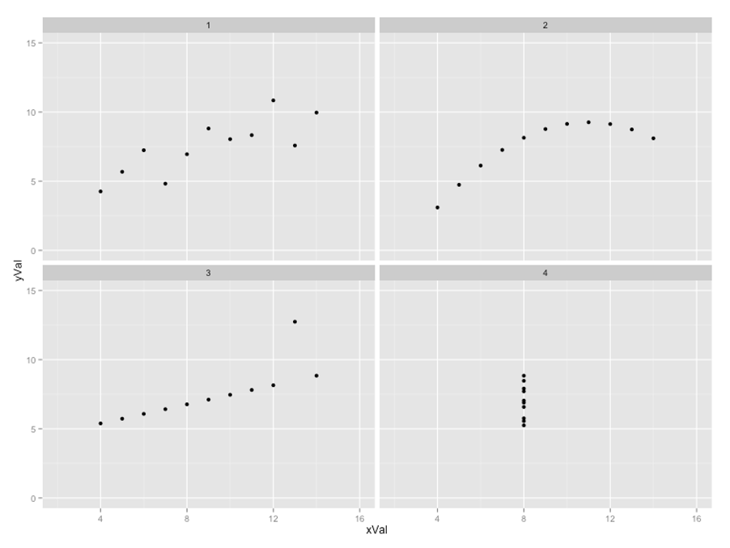

---
### The Tiger that Isn't

> I would argue that the basic purpose of charts and of statistics as a whole is to help us untangle signal from noise. We are ‘programmed’ to see signals, so we need to set the standard for ‘it’s a tiger!’ quite high in research & in policy-making.

^ Or, as Albert Einstein reportedly said: "If I can't picture it, I can't understand it."

---
## Think it Through

You can make a lot of progress in your research without *any* advanced statistics!

- A 'picture' isn’t *just* worth 1,000 words, it could be a whole dissertation!
- The right chart makes your case eloquently and succinctly. 

Always ask yourself:
- What am I trying to say?
- How can I say it most effectively?
- Is there anything I’m overlooking in the data?

A good chart is a good way to start!

---
### What Makes a Good Plot?

A good chart or table:

1. Serves a **purpose** — it is clear how it advances the argument in a way that could not be done in the text _alone_.
2. Contains only what is **relevant** — zeroes in on what the reader _needs_ and is not needlessly cluttered.
3. Uses precision that is **meaningful** — 

^ Far too many charts or tables could be easily written up in a single sentence.

^ Far too many charts or tables contain redundancy, clutter, and 'flair'.

^ Don't report average height of your class to sub-millimeter level accuracy, or lat/long to sub-atomic scale.

---
### For Example...

How much precision is necessary? [Wikipedia](https://en.wikipedia.org/wiki/Decimal_degrees#Precision) has the answer at the equator!

| Decimal Places | Degrees    | Distance |
| -------------- | ---------- | -------: |
| 0              | 1          |    111km |
| 1              | 0.1        |   11.1km |
| 2              | 0.01       |   1.11km |
| 3              | 0.001      |     111m |
| 4              | 0.0001     |    11.1m |
| 5              | 0.00001    |    1.11m |
| 6              | 0.000001   |   11.1cm |
| 7              | 0.0000001  |   1.11cm |
| 8              | 0.00000001 |   1.11mm |

---
### Goals by World Cup Final


---
### Goals by World Cup Final

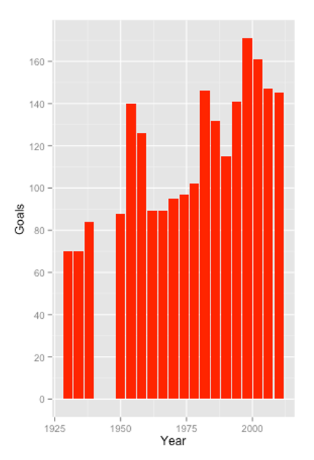

---
### Average Goals by World Cup Final

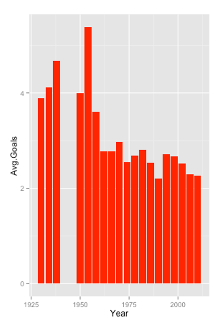

^ In 1982 the number of teams went from 16 to 24, and in 1998 it went from 24 to 32!

---
### How far from Equality?

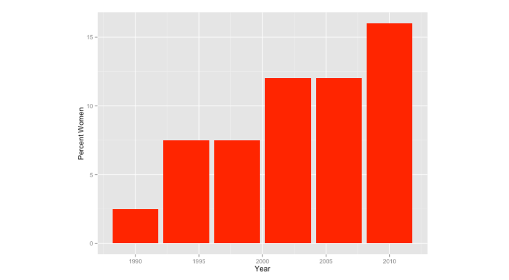

---
### How far from Equality?

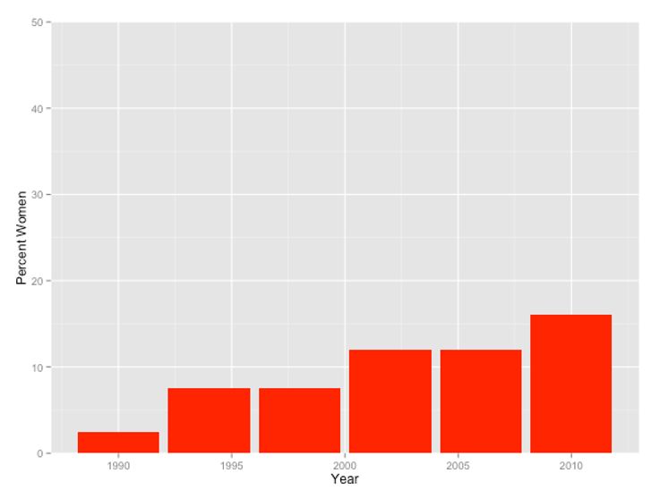

---
### The Purpose of a Chart

The purpose of a graph is to show that there are *relationships* within the observations in a data set.

Choose the chart to highlight relationships / lack thereof:
- Think of a chart or table as part of your ‘argument’ – if you can’t tell me how a figure advances your argument (or if your explanation is more concise than the figure) then you probably don’t need it.
- Identify & prioritise the relationships in the data.
- Choose a chart type/chart symbology that gives emphasis to the most important relationships.

---

> If a picture is worth 1,000 words, make sure those words aren't "blah, blah, blah..."

---
Layout: SectionTitle
## Beyond the Chart

---

> Getting information from a table is like extracting sunlight from a cucumber.
> Arthur & Henry Fahrquhar 1891)

---
### Real Numbers

Consider the difference in emphasis between:

- 11316149
- 11,316,149
- 11.3 million
- 11 x 10$$^{6}$$
- 22%
- 22.2559%

Always keep in mind the *purpose* of the number.

---
### There's _Still_ a Role for Tables

Why a table is sometimes better than a chart:

- You need to present data values with greater detail
- You need to enable readers to draw comparisons between data values
- You need to present the same data in multiple ways (*e.g.* raw number *and* percentage)
- You want to show many dimensions for a small number of observations

^ *e.g.* percentage of people falling into each ethnic or income category for a small number of wards or boroughs.

---
### Undergraduate Tables (Failing Grade)

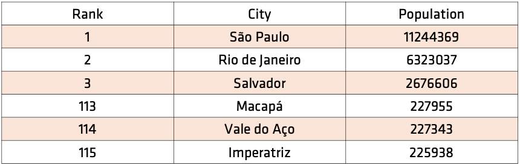

---
### Undergraduate Tables (Passing Grade)

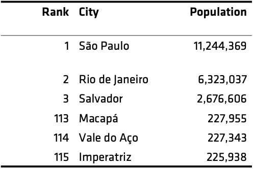

---
### Postgraduate Tables (Failing Grade)

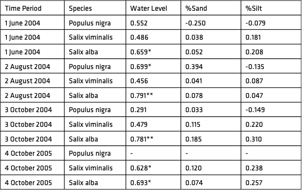

---
### Postgraduate Tables (Failing Grade)

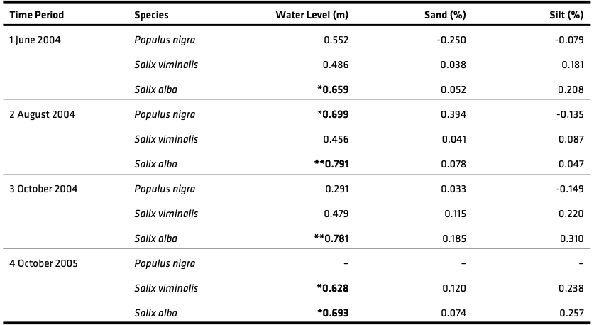

---
### Design for Tables

Principles:

- Reduce the number of lines to a minimum (and you should almost never need vertical lines).
- Use ‘white-space’ to create visual space between groups of unrelated (or less related) elements.
- Remove redundancy (if you find yourself typing ‘millions’ or ‘GBP’ or ‘Male’ repeatedly then you’ve got redundancy).
- Ensure that meta-data is clearly separate from, but attached to, the graph (*i.e.* source, title, etc.).

---
Layout: SectionTitle
## Deploying Python

---
### Handy Recall

If you are trying to follow along by writing code...

```python
import pandas as pd
import geopandas as gpd
url='https://bit.ly/3owocdI'
df = pd.read_csv(url) 
df['price'] = df.price.str.replace('$','').astype('float')
```

This will load the sampled Airbnb data from GitHub. You can always download it and load it locally (maybe a good `utilty` function to package up?)

---
### What Can We Do? (Series)

This is by no means all that we can do...

| Command           | Returns                   |
| :---------------- | :------------------------ |
| `s.mean()`        | Mean                      |
| `s.count()`       | Number of non-null values |
| `s.max()`         | Highest value             |
| `s.min()`         | Lowest value              |
| `s.median()`      | Median                    |
| `s.std()`         | Standard deviation        |
| `s.quantile(q=x)` | $$x^{th}$$ quantile         |

---
### What Can We Do? (Data Frame)

| Command         | Returns                                  |
| :-------------- | :--------------------------------------- |
| `df.mean()`     | Mean of each column                      |
| `df.count()`    | Number of non-null values in each column |
| `df.max()`      | Highest value in each column             |
| $$\vdots$$       | $$\vdots$$                              |
| `df.corr()`     | Correlation between columns              |
| `df.describe()` | Summarise                                |

^ Notice how we have the *same* functionality, but it operates at the level of the data set itself now. We gain a few *new* functions as well that relate to interactions between columns (a.k.a. data series).

---
## Measures

So pandas provides functions for commonly-used measures:

```python
print(df.price.mean())
print(df.price.median())
print(df.price.quantile(0.25))
```

Output:
```
118.4542
80.5
40.75
```

---
### More Complex Measures

But Pandas *also* makes it easy to derive new variables:

```python
df['zscore'] = (df.price - df.price.mean())/df.price.std()
df.zscore.describe()
```

```
count    1.000000e+02
mean    -1.332268e-17
std      1.000000e+00
min     -8.351963e-01
25%     -6.273139e-01
50%     -3.064081e-01
75%      2.546724e-01
max      5.486042e+00
Name: zscore, dtype: float64
```

---
### And Even More Complex

```python
df['iqr_std'] = (df.price - df.price.median())/ \
      (df.price.quantile(q=0.75)-df.price.quantile(q=0.25))
df.iqr_std.describe()
```

```python
count    100.000000
mean       0.347407
std        1.133804
min       -0.599542
25%       -0.363844
50%        0.000000
75%        0.636156
max        6.567506
Name: iqr_std, dtype: float64
```

---
## The Plot Thickens

We'll get to more complex plotting over the course of the term, but here's a good start for *exploring* the data! All plotting depends on `matplotlib` which is the ogre in the attic to R's `ggplot`.

```python
import matplotlib.pyplot as plt
```

This will allow you to save and manipulate the figures created in Python. It is *not* the most intuitive approach (unless you've used MATLAB before) but it *does* work. 
---
> **Confession Time:** I *do* like `ggplot` and sometimes even finish off graphics for articles in R *just* so that I can use `ggplot`; however, it *is* possible to generate great-looking figures in `matplotlib` but it is often more work because it's a _lot_ less intuitive.

---
### Boxplot

```python
df.price.plot.box()
plt.savefig('pboxplot.png', dpi=150, transparent=True)
```

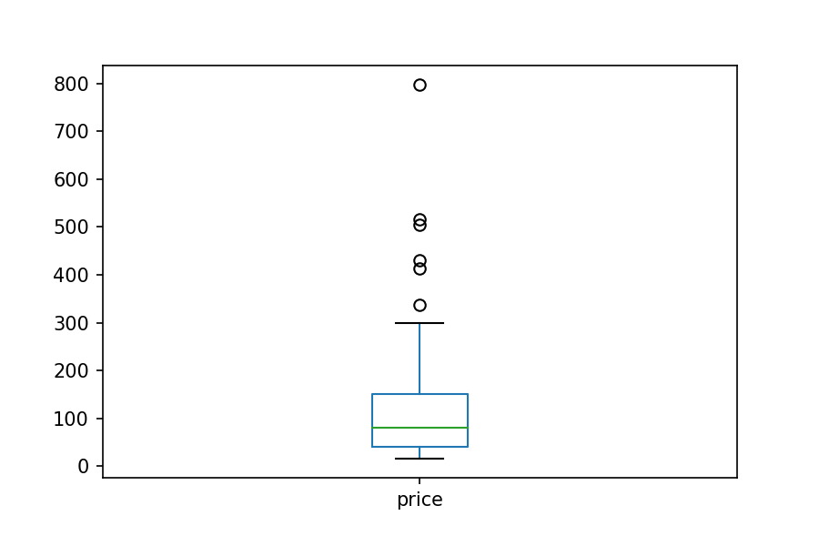

---
### Frequency

```python
df.room_type.value_counts().plot.bar()
plt.savefig('phistplot.png', dpi=150, transparent=True)
```

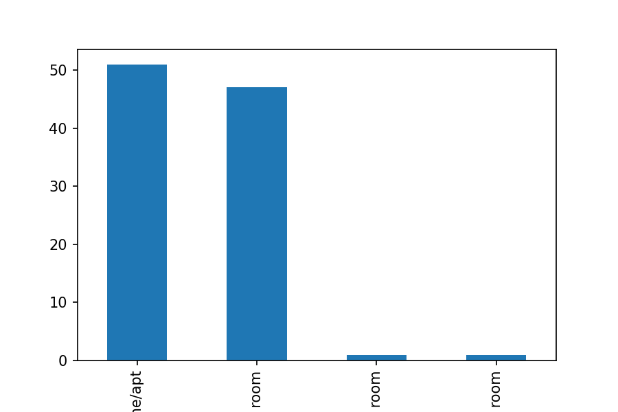

---

### A Correlation Heatmap

We'll get to these in more detail in a couple of weeks, but here's some useful output... 

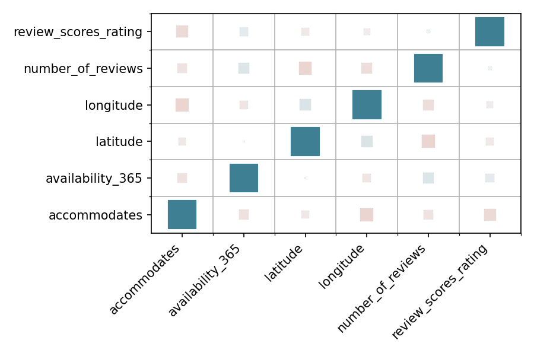

---
### A 'Map'

```python
df.plot.scatter(x='longitude',y='latitude')
plt.savefig('pscatterplot.png', dpi=150, transparent=True)
```

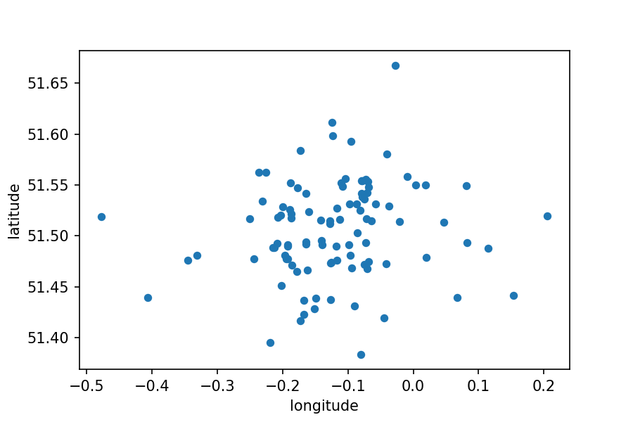

---
### A Fancy 'Map'

```python
df.plot.scatter(x='longitude',y='latitude',
                c='price',colormap='viridis',
                figsize=(10,5),title='London',
                grid=True,s=24,marker='x')
plt.savefig('pscatterplot.png', dpi=150, transparent=True)
```

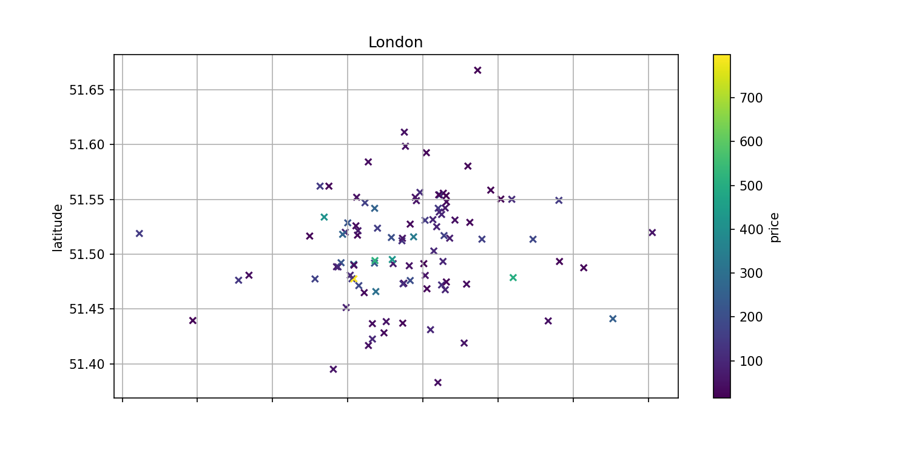

---

### An Actual 'Map'

```python
gdf = gpd.GeoDataFrame(df, 
      geometry=gpd.points_from_xy(df['longitude'], df['latitude'], crs='epsg:4326'))
gdf.plot(column='price', cmap='viridis', scheme='quantiles', markersize=8, legend=True)
```

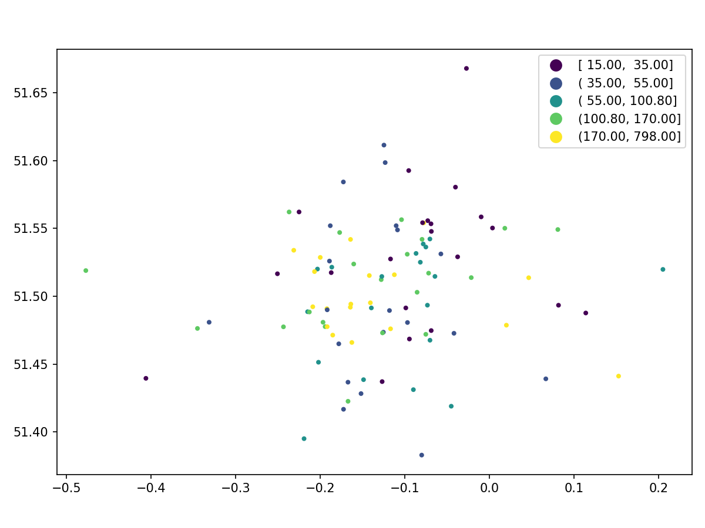

---
## Resources

There's [so much more](https://www.google.com/search?q=eda+with+pandas) to find, but:

- [Pandas Reference](https://pandas.pydata.org/pandas-docs/stable/reference/api/pandas.DataFrame.plot.html)
- [A Guide to EDA in Python](https://levelup.gitconnected.com/cozy-up-with-your-data-6aedfb651172) (Looks very promising)
- [EDA with Pandas on Kaggle](https://www.kaggle.com/kashnitsky/topic-1-exploratory-data-analysis-with-pandas)
- [EDA Visualisation using Pandas](https://towardsdatascience.com/exploratory-data-analysis-eda-visualization-using-pandas-ca5a04271607)
- [Python EDA Analysis Tutorial](https://www.datacamp.com/community/tutorials/exploratory-data-analysis-python)
- [Better EDA with Pandas Profiling](https://towardsdatascience.com/a-better-eda-with-pandas-profiling-e842a00e1136) **[Requires module installation]**
- [EDA: DataPrep.eda vs Pandas-Profiling](https://towardsdatascience.com/exploratory-data-analysis-dataprep-eda-vs-pandas-profiling-7137683fe47f) **[Requires module installation]**
- [A Data Science Project for Beginners (EDA)](https://medium.com/analytics-vidhya/a-data-science-project-for-beginners-exploratory-data-analysis-eda-d334f58f94ee)
- [EDA: A Pracitcal Guide and Template for Structured Data](https://towardsdatascience.com/exploratory-data-analysis-eda-a-practical-guide-and-template-for-structured-data-abfbf3ee3bd9)
- [EDA—Don't ask how, ask what](https://medium.com/towards-artificial-intelligence/exploratory-data-analysis-eda-dont-ask-how-ask-what-2e29703fb24a) (Part 1)
- [Preparing your Dataset for Modeling – Quickly and Easily](https://medium.com/towards-artificial-intelligence/preparing-your-dataset-for-modeling-quickly-and-easily-c8c1b89fdb2e) (Part 2)
- [Handling Missing Data](https://towardsdatascience.com/handling-missing-data-for-a-beginner-6d6f5ea53436)
- [Introduction to Exploratory Data Analysis (EDA)](https://medium.com/code-heroku/introduction-to-exploratory-data-analysis-eda-c0257f888676)
