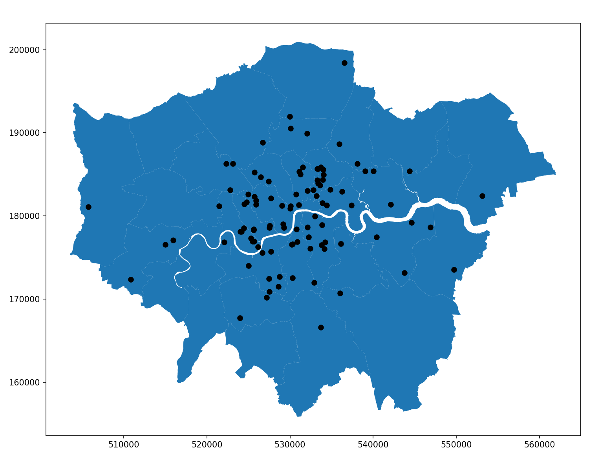

Theme: casa notes
Palette: Purple
Size: Wide
Title: File Formats
Author: Jon Reades

---
Layout: Title
# Exploratory Spatial Data Analysis

## (With PySAL & GeoPandas)

---

### Handy Recall

If you are trying to follow along by writing code...

```python
import pandas as pd
import geopandas as gpd
url='https://bit.ly/3owocdI'
df = pd.read_csv(url) 
df['price'] = df.price.str.replace('$','').astype('float')
gdf = gpd.GeoDataFrame(df, 
        geometry=gpd.points_from_xy(
          df['longitude'], df['latitude'], crs='epsg:4326'
        )
      )
```

This will load the sampled Airbnb data from GitHub. You can always download it and load it locally (maybe a good `utilty` function to package up?)

---

## Getting Spatial

https://darribas.org/gds_course/content/bF/lab_F.html

```python
url = 'https://bit.ly/3neINBV'
boros = gpd.read_file(url, driver='GPKG')
boros.plot()
```

---

### Boroughs & Airbnb Sample



---

### Convex Hull


---

### Dissolve


----

### Simplify


---

### Buffer


---

### Buffer & Simplify


---

### Difference

With some nice chaining...


---

### Legendgrams


---

### KNN Weights


---

### Distance Band


---

### Moran's I


---

### Local Moran's I


---

### Full LISA


---


### Set Operations

https://geopandas.org/set_operations.html

---

### Colors Schemes

[See documentation](https://geopandas.org/mapping.html#choosing-colors)

---

### Missing Data

[See documentation](https://geopandas.org/mapping.html#missing-data)

---

## Resources

There's [so much more](https://www.google.com/search?q=eda+with+pandas) to find, but:

- [Pandas Reference](https://pandas.pydata.org/pandas-docs/stable/reference/api/pandas.DataFrame.plot.html)
- [EDA with Pandas on Kaggle](https://www.kaggle.com/kashnitsky/topic-1-exploratory-data-analysis-with-pandas)
- [EDA Visualisation using Pandas](https://towardsdatascience.com/exploratory-data-analysis-eda-visualization-using-pandas-ca5a04271607)
- [Python EDA Analysis Tutorial](https://www.datacamp.com/community/tutorials/exploratory-data-analysis-python)
- [Better EDA with Pandas Profiling](https://towardsdatascience.com/a-better-eda-with-pandas-profiling-e842a00e1136) **[Requires module installation]**
