Theme: casa notes
Palette: Purple
Size: Wide
Title: File Formats
Author: Jon Reades

---
Layout: Title
## Exploratory Spatial Data Analysis
## (With PySAL & GeoPandas)

---
### About PySAL
[Read the Docs](https://pysal.org/documentation).

{{Mind-Map}}
PySAL
	libpysal
		weights
			Distance Weights
			Continguity Weights
	explore
		esda
		inequality
		pointpats
		...
	model
		mgwr
		spglm
		spreg
		...
	viz
		legendgram
		mapclassify
		splot

---
## Getting Spatial (with Boroughs)

```python
import geopandas as gpd
url = 'https://bit.ly/3neINBV'
boros = gpd.read_file(url, driver='GPKG')
boros.plot(color='none',edgecolor='red')
```


---
### Handy Recall

And if you are trying to follow along by writing code...

```python
import pandas as pd
url ='https://bit.ly/3owocdI'
df  = pd.read_csv(url) 
df['price'] = df.price.str.replace('$','').astype('float')
gdf = gpd.GeoDataFrame(df, 
        geometry=gpd.points_from_xy(
          df['longitude'], df['latitude'], crs='epsg:4326'
        )
      )
```

This will load the sampled Airbnb data from GitHub.

---
### Convex Hull

```python
boros['hulls'] = boros.geometry.convex_hull
boros = boros.set_geometry('hulls')
boros.plot(column='NAME', categorical=True, alpha=0.5)
```
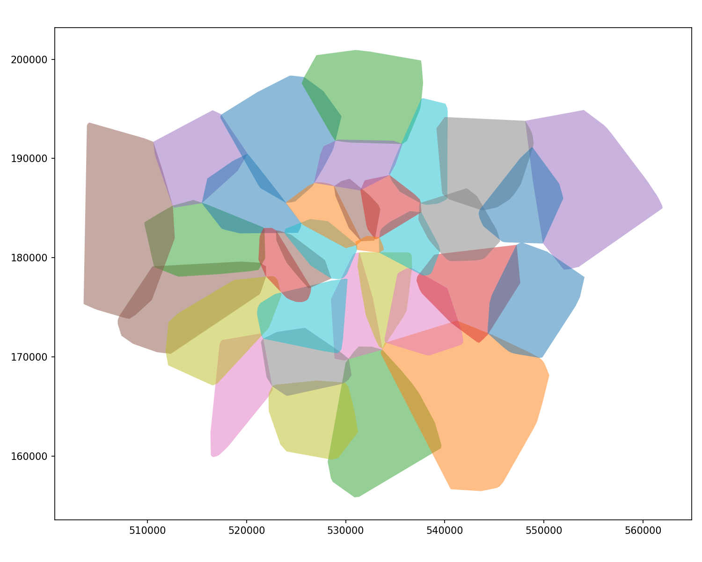

---
### Dissolve

```python
boros['region'] = 'London'
ldn = boros.dissolve(by='region')

f,ax = plt.subplots(figsize=(10,8))
ldn.plot(ax=ax)
gdf.plot(ax=ax, column='price', scheme='HeadTailBreaks', cmap='inferno')
```

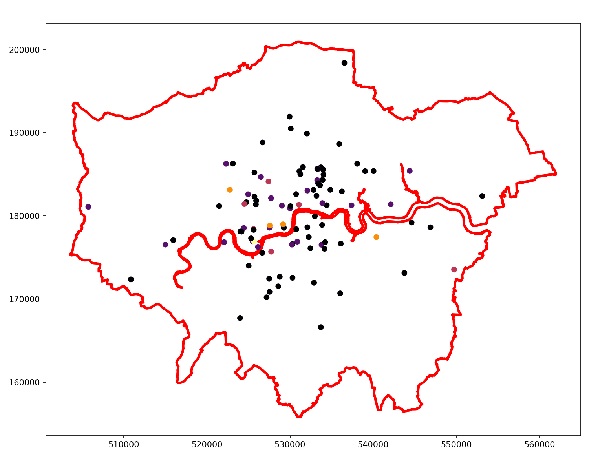

---
### Simplify

```python
ldn.simplify(250).plot()
```
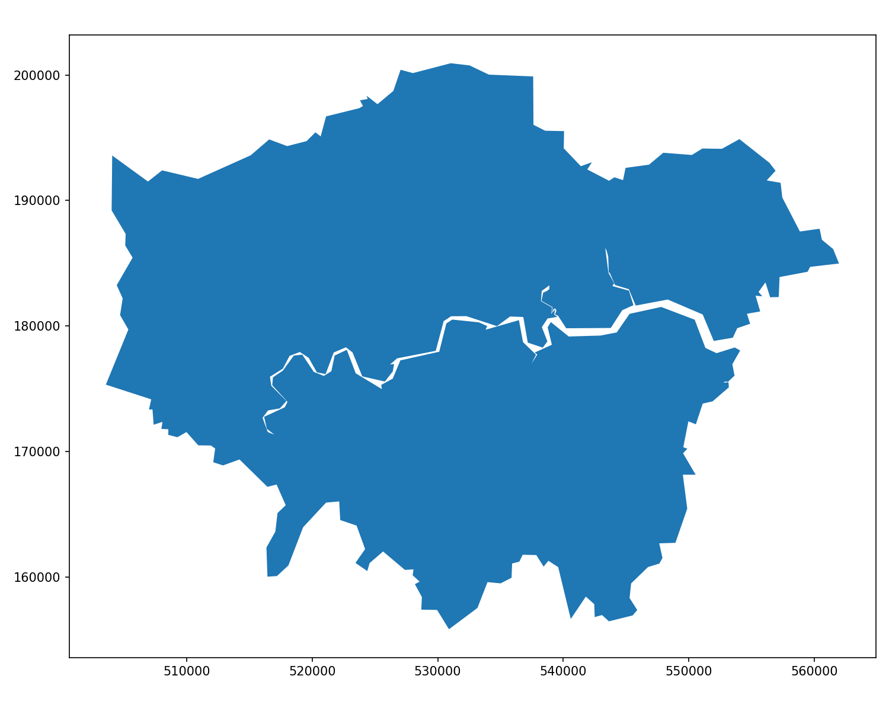

---
### Buffer

```python
ldn.buffer(500).plot()
```
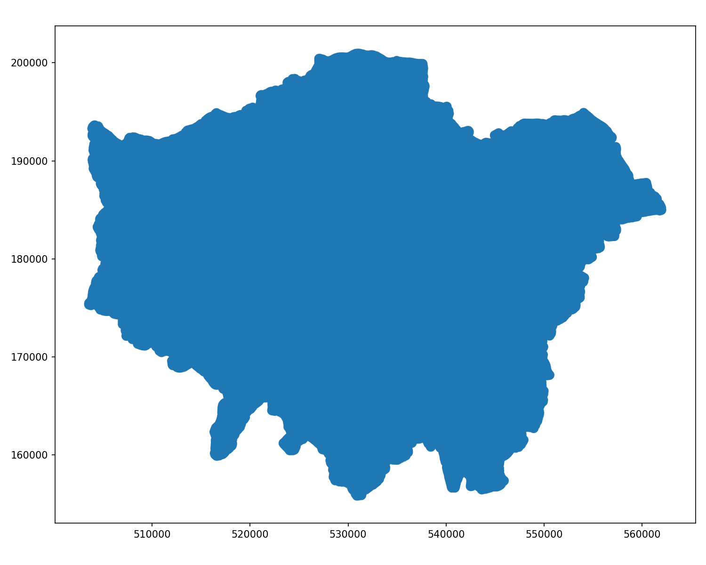

---
### Buffer & Simplify

```python
ldn.buffer(1000).simplify(1000).plot()
```
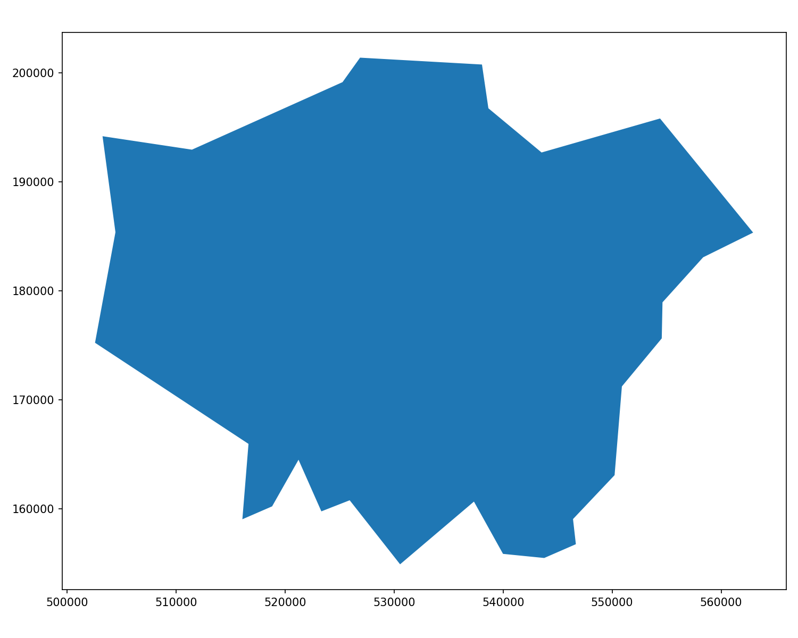

---
### Difference

And some nice chaining...
```python
ldn.buffer(3000).simplify(2500).difference(ldn.geometry).plot()
```
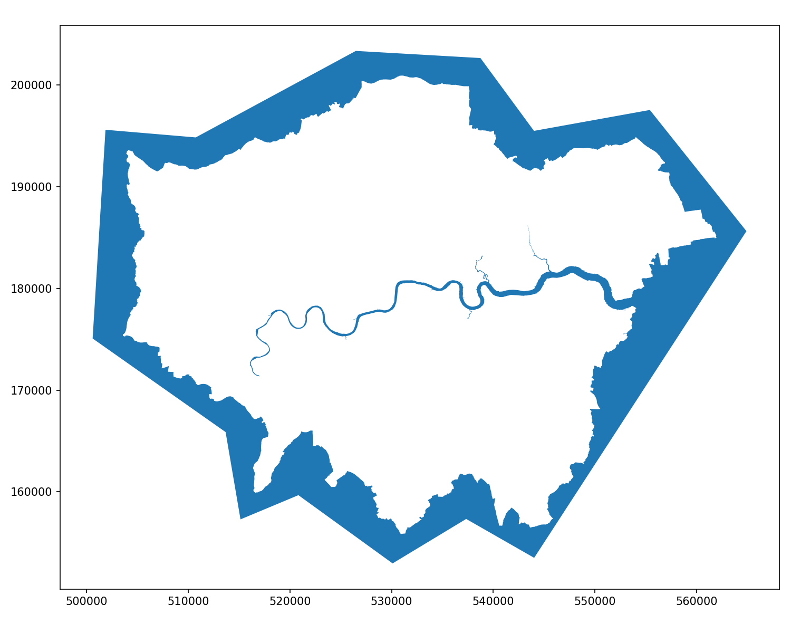

---
### Legendgrams

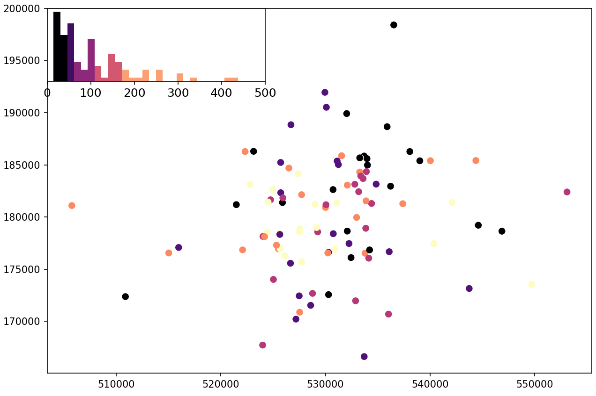

---
### Implementing Legendgrams

```python
import pysal as ps
# https://github.com/pysal/mapclassify
import mapclassify as mc
# https://jiffyclub.github.io/palettable/
import palettable.matplotlib as palmpl
from legendgram import legendgram

f,ax = plt.subplots(figsize=(10,8))
gdf.plot(column='price', scheme='Quantiles', cmap='magma', k=5, ax=ax)
q = mc.Quantiles(gdf.price.values, k=5)

# https://github.com/pysal/legendgram/blob/master/legendgram/legendgram.py
legendgram(f, ax, 
               gdf.price, q.bins, pal=palmpl.Magma_5,
               legend_size=(.4,.2), # legend size in fractions of the axis
               loc = 'upper left', # mpl-style legend loc
               clip = (0,500), # clip range of the histogram
               frameon=True)
```

^ Note that the number of colours need to match *k*, which is 5 in this case.
^ It *should* be possible to set up the colormap and bins such that they can be passed to both GeoPandas and Legendgram.

---

### KNN Weights

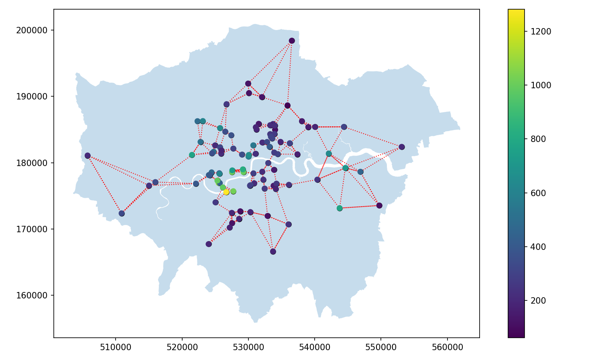

--- 
### Implementing KNN

```python
from pysal.lib import weights
w = weights.KNN.from_dataframe(gdf, k=3)
gdf['w_price'] = weights.lag_spatial(w, gdf.price)
gdf[['name','price','w_price']].sample(5, random_state=42)
```

|    | name | price | w_price |
| :- | :--- | ----: | ------: |
| 83 | Southfields Home | 85.0 | 263.0 |
| 53 | Flat in Islington, Central London | 55.0 | 190.0 | 
| 70 | 3bedroom Family Home minutes from Kensington Tube | 221.0 | 470.0 | 
| 453 | Bed, 20 min to Liverpool st, EAST LONDON | 110.0 | 186.0 | 
| 44 | Avni Kensington Hotel | 430.0 | 821.0 |

---
### Spatial Lag of Distance Band

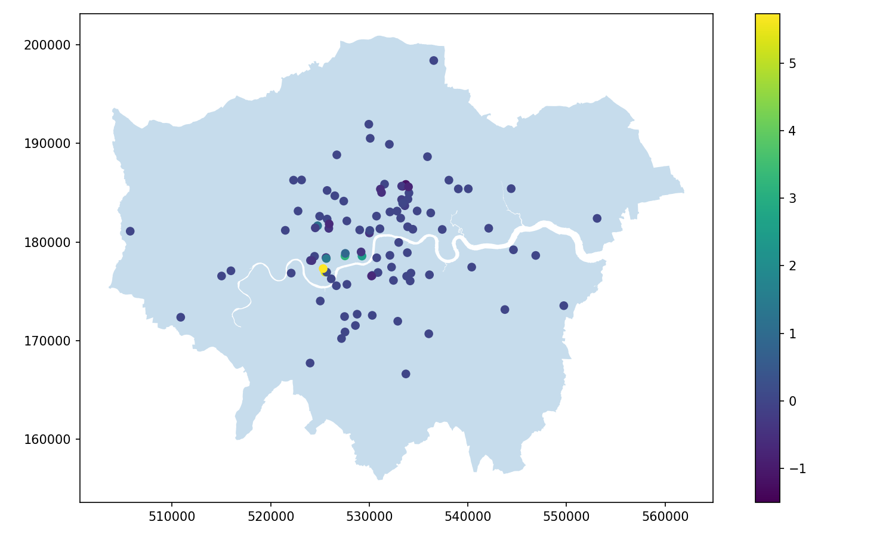

---
### Implementing DB

```python
w2 = weights.DistanceBand.from_dataframe(gdf, threshold=2000, alpha=-0.25)
gdf['price_std'] = (gdf.price - gdf.price.mean()) / gdf.price.std()
gdf['w_price_std'] = weights.lag_spatial(w2, gdf.price_std)
gdf[['name','price_std','w_price_std']].sample(5, random_state=42)
```

|    | name | price_std | w_price_std |
| :- | :--- | ----: | ------: |
| 83 | Southfields Home | -0.27 | 0.00 |
| 53 | Flat in Islington, Central London | -0.51 | -0.58 | 
| 70 | 3bedroom Family Home minutes from Kensington Tube | 0.83 | 0.46 | 
| 453 | Bed, 20 min to Liverpool st, EAST LONDON | -0.07 | -0.82 | 
| 44 | Avni Kensington Hotel | 2.52 | 3.25 |

---
### Moran's I
```python
mi = esda.Moran(gdf['price'], w)
print(f"{mi.I:0.4f}")
print(f"{mi.p_sim:0.4f}")
moran_scatterplot(mi)
```
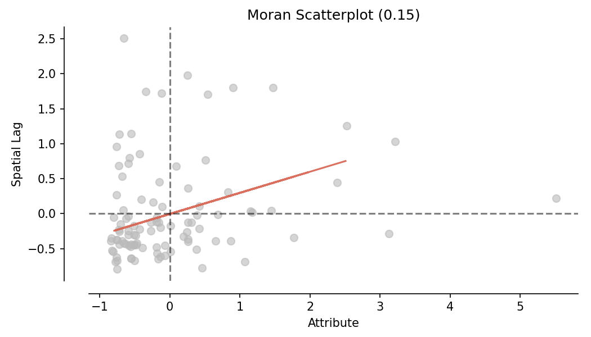

---
### Local Moran's I

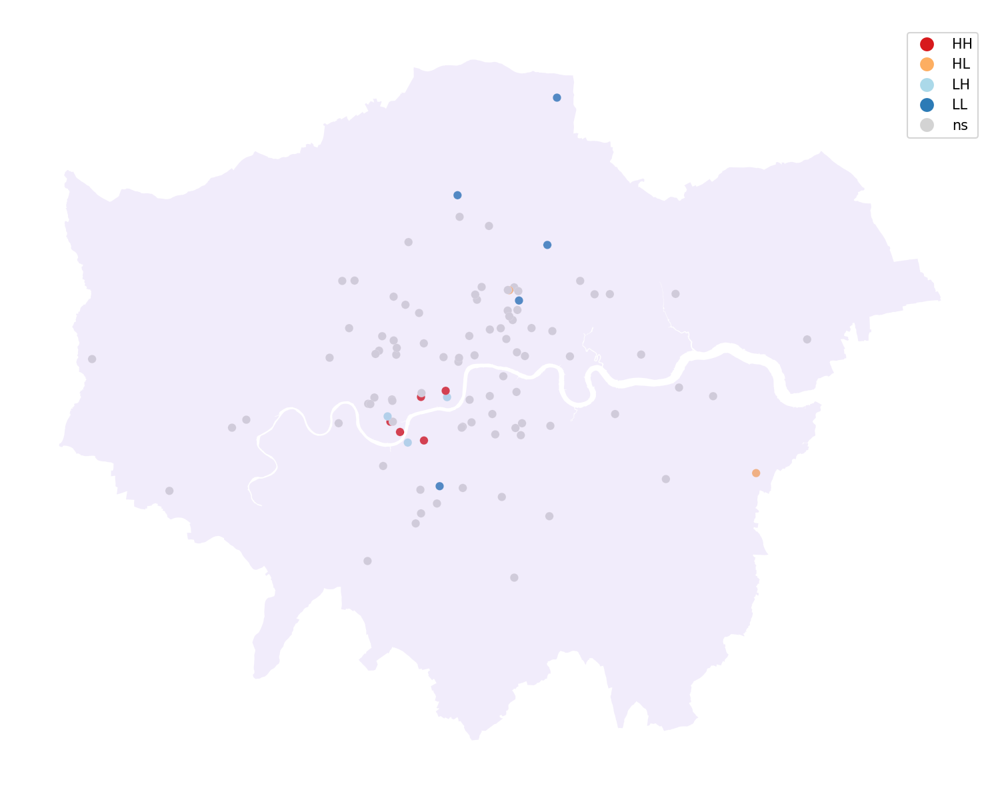

---
### Implementing Local Moran's I

```python
lisa = esda.Moran_Local(gdf.price, w)
# Break observations into significant or not
gdf['sig'] = lisa.p_sim < 0.05
# Store the quadrant they belong to
gdf['quad'] = lisa.q
gdf[['name','price','sig','quad']].sample(5, random_state=42)
```

|    | name | price | sig | quad |
| :- | :--- | ----: | ------: | --: |
| 83 | Southfields Home | 85.0 | False | 3 |
| 53 | Flat in Islington, Central London | 55.0 | False | 3 |
| 70 | 3bedroom Family Home minutes from Kensington Tube | 221.0 | False | 1 |
| 453 | Bed, 20 min to Liverpool st, EAST LONDON | 110.0 | False | 3 |
| 44 | Avni Kensington Hotel | 430.0 | False | 1 |

---
### Full LISA

```python
plot_local_autocorrelation(lisa, gdf, 'price')
```

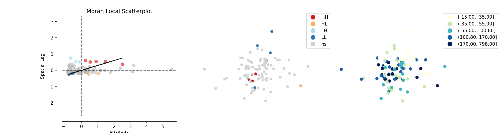

---

## Resources

There's [so much more](https://www.google.com/search?q=eda+with+pandas) to find, but:

- [Pandas Reference](https://pandas.pydata.org/pandas-docs/stable/reference/api/pandas.DataFrame.plot.html)
- [EDA with Pandas on Kaggle](https://www.kaggle.com/kashnitsky/topic-1-exploratory-data-analysis-with-pandas)
- [EDA Visualisation using Pandas](https://towardsdatascience.com/exploratory-data-analysis-eda-visualization-using-pandas-ca5a04271607)
- [Python EDA Analysis Tutorial](https://www.datacamp.com/community/tutorials/exploratory-data-analysis-python)
- [Better EDA with Pandas Profiling](https://towardsdatascience.com/a-better-eda-with-pandas-profiling-e842a00e1136) **[Requires module installation]**
- [Visualising Missing Data](https://geopandas.org/mapping.html#missing-data)
- [Choosing Map Colours](https://geopandas.org/mapping.html#choosing-colors)
