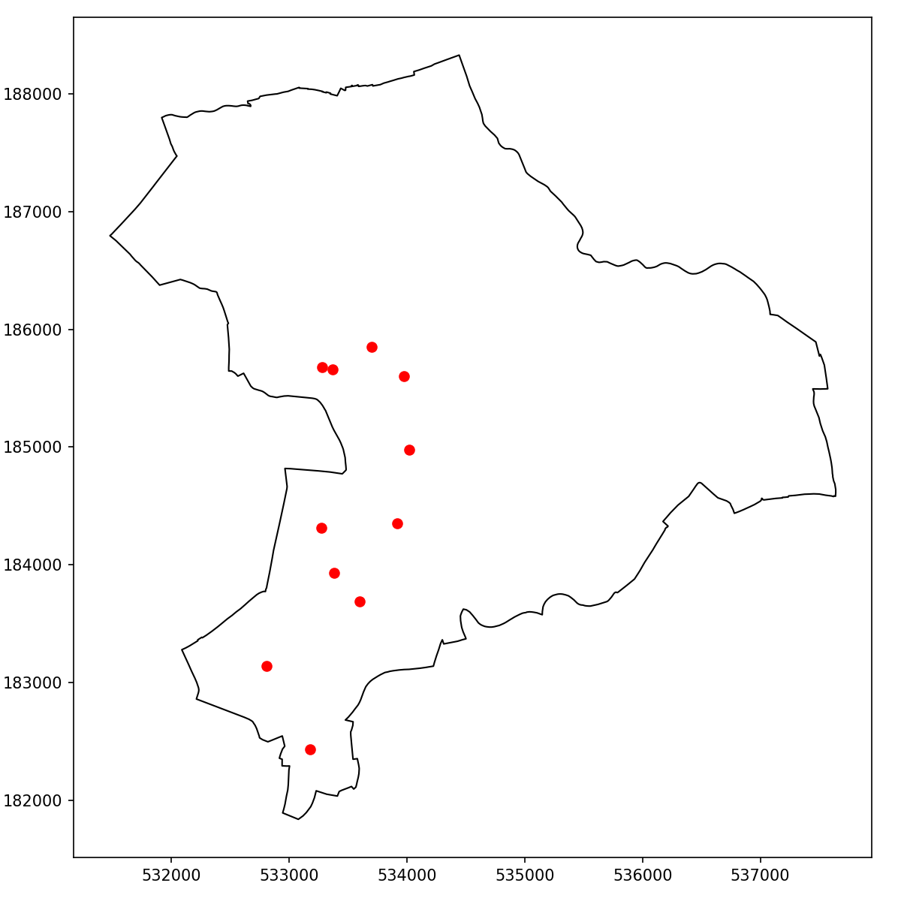
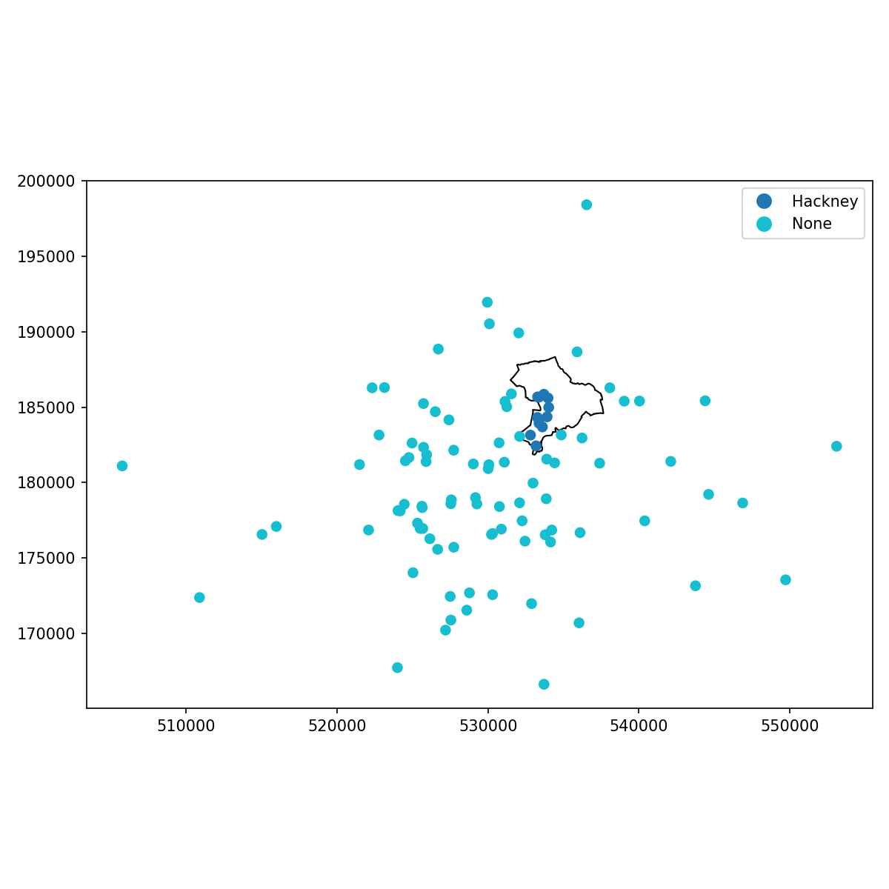

Theme: casa notes
Palette: Purple
Size: Wide
Title: File Formats
Author: Jon Reades

---

Layout: Title

# Linking Spatial Data

---

## Premise

> Data sets with spatial attributes can be connected in more complex ways than those without such attributes, consequently the ability to link such data unlocks exciting new applications!

---

## Non-Spatial Linkages can be Spatial

---

Layout: Split

### Data Set 1

| SensorID | Latitude | Longitude |
| -------- | -------- | --------- |
| 1        | 51.5070  | -0.1347   |
| 2        | 51.5071  | -0.0042   |
| 3        | 51.5074  | -0.1223   |
| 4        | 51.5073  | -0.1122   |
| 5        | 51.5072  | 0.1589    |

+++

### Data Set 2

| SensorID | Parameter   | Value |
| -------- | ----------- | ----- |
| 1        | Temperature | 5ºC   |
| 1        | Humidity    | 15%   |
| 3        | Temperature | 7ºC   |
| 4        | Temperature | 7ºC   |
| 6        | Humidity    | 18%   |

^ Obviously, we can use non-spatial operations on spatial data sets.

---

## Sjoin vs. Join

Sjoin is Geopandas' counterpart to Pandas' join. Syntax is the same, but adds an *operator* tha defines the type of spatial join: `op=['intersects','contains','within']`. The full code for the below can be [found on GitHub]().

```python
boros    = gpd.read_file('...Boroughs.gpkg?raw=true')
listings = df.read_csv('...2020-08-24-sample-listings-simple.csv')
gdf = gpd.GeoDataFrame(df, 
        geometry=gpd.points_from_xy(df.longitude, df.latitude,
        crs='epsg:4326')).to_crs('epsg:27700')
hackney  = boros[boros.NAME=='Hackney']
rs = gpd.sjoin(gdf, hackney, op='within')
```



---

### Combining Operators & How

If you change `how` to one of `left`, `right`, or `inner` then you change the join's behaviour:

```python
rs = gpd.sjoin(gdf, hackney, how='left', op='within')
rs.NAME.fillna('None', inplace=True)
ax = boros[boros.NAME=='Hackney'].plot(edgecolor='k', facecolor='none', figsize=(8,8))
rs.plot(ax=ax, column='NAME', legend=True)
```



---

### Merging Data

These [merge operators](https://geopandas.org/mergingdata.html#merging-data) apply where `a` is the *left* set of features (in a GeoSeries or GeoDataFrame) and `b` is the *right* set:

- Contains: Returns `True` if no points of b lie outside of a and *at least one point* of b of other lies inside a.
- Within: Returns `True` if a’s boundary and interior intersect only with the interior of b (not its boundary or exterior).
- Intersects: Returns `True` if the boundary or interior of a intersects in any way with those of b.

All [binary predicates](https://shapely.readthedocs.io/en/latest/manual.html#binary-predicates) are supported by features of GeoPandas, though *only* these three options are available in `sjoin` directly.

^ Behaviour of operaions may vary with how you set up `left` and `right` tables, but you can probably think your way through it by asking: "Which features of x fall *within* features of y?" or "Do features of x contain y?" You will probably get it wrong at least a few times. That's ok.

---

### Additional Spatial Operations

These operators apply to the [GeoSeries](https://geopandas.org/reference.html#geoseries) where `a` is a GeoSeries and `b` is one or more spatial features:

- **Contains** / **Covers**: Returns a `Series` of `dtype('bool')` with value `True` for each geometry in `a` that contains `b`. These are *different*.
- **Crosses**: An object is said to cross other if its interior intersects the interior of the other but does not contain it, and the dimension of the intersection is less than the dimension of the one or the other.
- **Touches**: Returns a `Series` indicating which elements of `a` touch a point on `b`.
- **Distance**: Returns a `Series` containing the distance from all `a` to some `b`.
- **Disjoint**: Returns a `Series` indicating which elements of `a` do not intersect with any `b`.
- **Geom Equals** / **Geom Almost Equals**: strict and loose tests of equality between `a` and `b` in terms of their geometry.
-  **Buffer**, **Simplify**, **Centroid**, **Representative Point**: common transformations.
- **Rotate**, **Scale**, **Affine Transform**, **Skew**, **Translate**: less common transformations.
- **Unary Union**: aggregation of all the geometries in `a`

---

### RTM

> In particular, "contains" (and its converse "within") has an aspect of its definition which may produce unexpected behaviour. This quirk can be expressed as "*Polygons do not contain their boundary*". More precisely, the definition of contains is:
>
> *Geometry A **contains** Geometry B iff no points of B lie in the exterior of A, and at least one point of the interior of B lies in the interior of A*
>
> That last clause causes the trap – because of it, a LineString which is completely contained in the boundary of a Polygon is **not** considered to be contained in that Polygon!
>
> This behaviour could easily trip up someone who is simply trying to find all LineStrings which have no points outside a given Polygon. In fact, this is probably the most common usage of contains. For this reason it's useful to define another predicate called covers, which has the intuitively expected semantics:
>
> *Geometry A **covers** Geometry B iff no points of B lie in the exterior of A*

---

## Set Operations with Overlay

It is also possible to apply 'overlay' operations as used in a GIS:


[These operations](https://geopandas.org/set_operations.html#set-operations-with-overlay) return indexes for `gdf1` and `gdf2` (either could be a `NaN`) together with a geometry and (usually?) columns from both data frames:

```python
rs_union = geopandas.overlay(gdf1, gdf2, how='union')
```

The set of operations includes: `union`, `intersection`, `difference`, `symmetric_difference`, `identity`.

^ A notebook example [can be found here](https://nbviewer.jupyter.org/github/geopandas/geopandas/blob/master/examples/overlays.ipynb).

---

