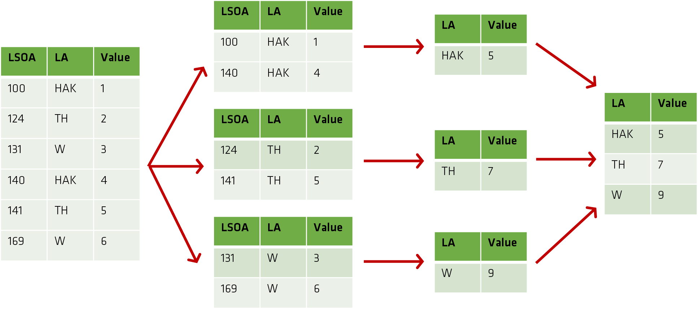
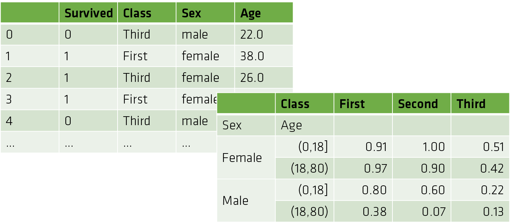

Theme: casa notes
Palette: Purple
Size: Wide
Title: File Formats
Author: Jon Reades

---

Layout: Title

# Grouping Data

---

> To investigate spatial effects at the neighbourhood level, we often need to be able to aggregate data. This can be done using a function and/or a grouping operation.

---

## Aggregating Functions

Many of these you will have seen before:

| count()          | Total number of items           |
| ---------------- | ------------------------------- |
| first(), last()  | First and last item             |
| mean(), median() | Mean and median                 |
| min(), max()     | Minimum and maximum             |
| std(), var()     | Standard deviation and variance |
| mad()            | Mean absolute deviation         |
| prod()           | Product of all items            |
| sum()            | Sum of all items                |

But that won't help us to examine what's happening at the level of a borough quickly and easily unless we can *also* group elements at the level of the borough *first*.

---

## Grouping Operations

In Pandas these follow a split / apply / combine approach:



^ Note that, for simplicity, I've abbreviate the Local Authority names since this is just a simplified example: `TH` (Tower Hamlets), `HAK` (Hackney), `W` (Westminster).

---

### In Practice

```python
grouped_df = df.groupby(<fields>).<function>
```

For instance, if we had a Local Authority (`LA`) field:

```python
grouped_df = df.groupby('LA').sum()
```

Using `apply` the function could be anything:

```python
def norm_by_data(x): # x is a column from the grouped df
	x['d1'] /= x['d2'].sum() 
	return x

df.groupby('LA').apply(norm_by_data)
```

---

### Grouping by Arbitrary Mappings

```python
mapping = {'HAK':'Inner',
					'TH':'Outer',
					'W':'Inner'}
df.set_index('LA', inplace=True)
df.groupby('mapping').sum()
```


---

### Note...

> A lot of what we've seen here (and in linking data) translates well into SQL (the declarative language of databases).

---

## Pivot Tables

A 'special case' of Group By features:

- Commonly-used in business to summarise data for reporting.
- Grouping (summarisation) happens along both axes (Group By operates only on one).
- `pandas.cut(<series>, <bins>)` can be a useful feature here since it chops a continuous feature into bins suitable for grouping.

---

### In Practice

```python
age = pd.cut(titanic['age'], [0, 18, 80])
titanic.pivot_table(
	'survived', ['sex', age], 'class')
```



---

## Deriving Measures of Concentration

> One of the benefits of grouping is that it enables us to derive measures of density/concentration; here are just a few... Location Quotient (LQ), Herfindah-Hirschman Index (HHI), Shanon Entropy.

^ I like easy measures.

---

### Location Quotient

The LQ for industry *i* in zone *z* is the share of employment for *i* in *z* divided by the share of employment of *i* in the entire region *R*.
$$
LQ_{zi} = \dfrac{Emp_{zi}/Emp_{z}}{Emp_{Ri}/Emp_{R}}
$$

|                         | High Local Share | Low Local Share |
| ----------------------- | ---------------- | --------------- |
| **High Regional Share** | $\approx 1$      | $< 1$           |
| **Low Regional Share**  | $> 1$            | $\approx 1$     |

^ In other words, this is a type of standardisation that enables to compare the concentration of Investment Bankers with the concentration of Accountants, even if there are many more Accountants than Bankers! But this can also apply to the share of flats to whole-property lettings just as easily.

^ Note that this is influenced by small sample sizes (e.g. the number of Fijians in Britain).

---

### Herfindahl-Hirschman index

The HHI for an industry *i* is the sum of squared market shares for each company in that industry:
$$
H = \sum_{i=1}^{N} s_{i}^{2}
$$

| Concentration Level                                          |           HHI |
| ------------------------------------------------------------ | ------------: |
| **Monopolistic**: one firm accounts for 100% of the market   |           1.0 |
| **Oligopolistic**: top five firms account for 60% of the market | $\approx$ 0.8 |
| **Competitive**: anything else?                              |      $<$ 0.5? |

^ If $s_{i} = 1$ then $s_{i}^{2} = 1$, while if $s_{i} = 0.5$ then $s_{i}^{2} = 0.25$ and $s_{i} = 0.1$ then $s_{i}^{2} = 0.01$.

^ This can be translated to compare, for instance, local and regional neighbourhood diversity: some cities are ethnically diverse *in aggregate* but highly segregated *at the local level*.

^ Note that this is influenced by the number of 'firms' (or ethnicities or...).

---

### Shanon Entropy

Shanon Entropy is an information-theoretic measure:
$$
H(X) = - \sum_{i=1}^{n} P(x_{i}) log P(x_{i})
$$
^ I often think of this as 'surprise': a high entropy measure means that it's hard to predict what will happen next. So randomness has high entropy. By extension, high concentration has *low* entropy (even if the result is surprising on the level of intuition: I wasn't expecting to see that) because I can predict a 6 on the next roll of the dice fairly easy if all of my previous rolls were 6s.